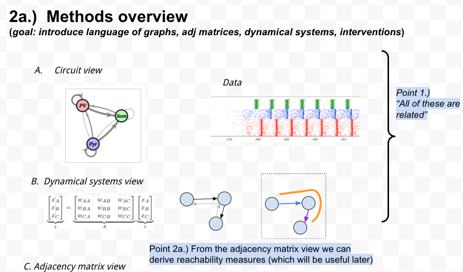
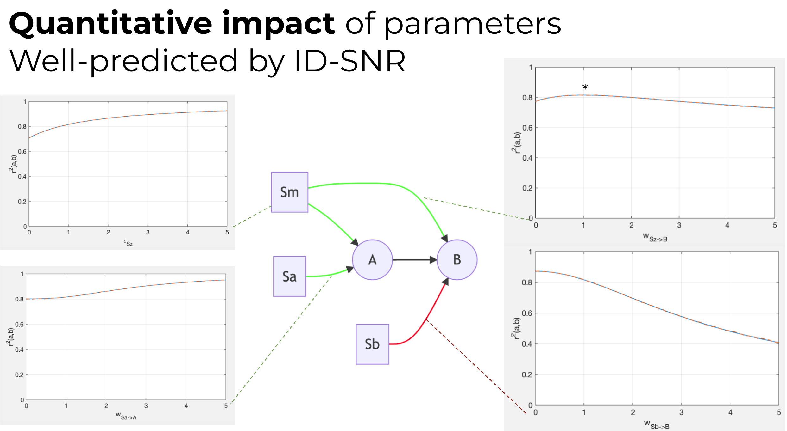
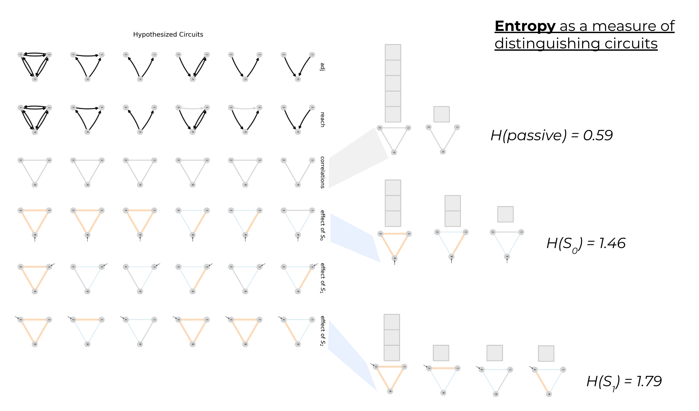

# Overview {ignore=true}
## Intended audience {ignore=true}
  - **systems neuroscientists** interested in making more rigorous conclusions in circuit ID problems 
  - **experimental neuroscientists** looking for guidance on evaluating required intervention to answer circuit hypothesis questions  
## Goal {ignore=true}
- Provide a practical conceptual framework for applying closed-loop to circuit identification problems
  - What’s the value of closed-loop?
  - What can i say about causal connections given the experiments i’m doing?
  - How do I design an intervention which improves the strength of hypothesis testing?
## Core Takeaways 🥡 {ignore=true}

[^risks]: really talking about risk with respect to conclusions  of inference here (not being able to conclude much, or concluding a connection is present when it isn't), rather than risk of injury

[^causal_takeaway]: we're currently treating this as "axiomatic" rather than explicitly demonstrating the value of a causal perspective. Also need to think about how much of our results rely on Causality™ versus broader graph theory / network theory / foundational statistics

**1. Thinking about causality is necessary**[^causal_takeaway] to judge potential value and anticipate unforeseen risks[^risks] of experiments.
  - If you "don't know what you don't know" you are susceptible to drawing false conclusions as a result of hidden confounds.
  - Understanding the uncertainty in outcomes given uncertainty in your assumptions / hypotheses empowers you to design efficient, targeted experiments.

**2. Intervening provides (categorical) improvements in inference power above passive observation.**
  - This potential advantage is large! whole categories of conclusions are invisible/indistinguishable under passive-observation that are revealed under sufficient intervention.
    - No amount of fancy inference will help.
  - *Secondarily,* there are also graded / quantitative advantages afforded by more active intervention (higher SNR, better data efficiency).
  - but it needs to be applied wisely to leverage that capability

**3. *How* you intervene** strongly determines the inference power of your experiment.
  - e.g. sophisticated closed-loop control applied to the wrong part of the circuit may not add any additional information.
      - Closed-loop control is like a high-powered microscope, but you have to point it at relevant samples / the right part of the glass slide.
  - **3B. *Where* to intervene** is the most important decision[^howmuch]
  - **3C.** The impact of intervention **depends strongly on its relationship to the structure** (and other properties) of the circuit being studied

[^howmuch]: the next most important decision is figuring out whether to use a high or low variance stimulus
[^design_recipe]: this describes the "brute force" design procedure. more sophisticated optimization may be possible.

**4.** Because how you intervene matters, it's valuable to **develop guidelines for designing useful intervention.** 
  - **4A.** To solve this, we need to **predict the impact** of intervention on a given circuit
  - **4B.** We then need a recipe for turning predictions into 

**choosing the best intervention**

  
    - explicitly enumerate your hypothesis set 
      - use causality + graph theory to find "lurking look-alikes" i.e. markov-equivalent circuits
    - run a design-optimization procedure[^design_recipe]
      - predict (using graph operations) the impact of intervention across your hypothesis set 
      - evaluate the utility of proposed interventions
        - especially in terms of reducing uncertainty about hypotheses
      - choose the best intervention 
    - observe data → update hypotheses (→iterate)
    

    
  - **4C.** By observing the relationship between circuit properties and the utility of particular interventions, we've distilled this understanding into 

general guidelines for when certain interventions are useful

  
    - CL $\geq$ OL $\gt$ passive
    - open-loop control, especially "upstream" in a circuit is likely to help reveal
    - these can act as priors in 4B. designing interventions
    

## Other themes {ignore=true}
**A. targetted exploration** (of dependence structure of variables)

  - **shaping covariance** is the focus of this paper.

... 

    - this is a key advantage of closed-loop control
      - which can have bidirectional influence over variance
    - *but* it's a specific example of a larger set of approaches which should work equally well with other, nonlinear, multivariate measures of dependence
    
    

    
**B.** Experiments for circuit inference can be thought of as **narrowing the set of plausible explanations**, refining a hypotheses space

--- 
# Table of Contents {ignore = true}

<!-- @import "[TOC]" {cmd="toc" depthFrom=1 depthTo=3 orderedList=false} -->
<!-- code_chunk_output -->

- [Abstract](#abstract)
- [Introduction](#introduction)
  - [Why? - Estimating causal interactions in the brain](#why-estimating-causal-interactions-in-the-brain)
  - [How? - Causal methods for network discovery from time-series](#how-causal-methods-for-network-discovery-from-time-series)
  - [Interventions in neuro](#interventions-in-neuro)
  - [Role of interventions in causal inference](#role-of-interventions-in-causal-inference)
  - [Multiple complementary perspectives (representations) of the same underlying network structure:](#multiple-complementary-perspectives-representations-of-the-same-underlying-network-structure)
  - [Reachability](#reachability)
  - [Understanding identification through derived properties of circuits (reachability rules)](#understanding-identification-through-derived-properties-of-circuits-reachability-rules)
  - [Figure DEMO: Applying CLINC to distinguish a pair of circuits (walkthrough)](#figure-demo-applying-clinc-to-distinguish-a-pair-of-circuits-walkthrough)
- [Methods](#methods)
  - [Network simulations](#network-simulations)
    - [Figure GAUSSIAN: Gaussian and spiking networks simulated in Brian2](#figure-gaussian-gaussian-and-spiking-networks-simulated-in-brian2)
  - [Implementing interventions](#implementing-interventions)
  - [Extracting circuit estimates](#extracting-circuit-estimates)
    - [Figure PIPELINE: Process of detecting connections in a network model](#figure-pipeline-process-of-detecting-connections-in-a-network-model)
    - [Outputs of network](#outputs-of-network)
    - [lagged cross-correlation](#lagged-cross-correlation)
    - [multivariate transfer entropy (muTE)](#multivariate-transfer-entropy-mute)
    - [statistical testing](#statistical-testing)
    - [Quantifying successful identification](#quantifying-successful-identification)
- [Results](#results)
  - [[Binary Sim.] - Characterizing circuit-pair ambiguity through binary reachability properties](#binary-sim-characterizing-circuit-pair-ambiguity-through-binary-reachability-properties)
  - [Characterization of network estimation performance - Impact of node, network parameters](#characterization-of-network-estimation-performance-impact-of-node-network-parameters)
    - [Figure PROPS: impact of intrinsic network properties on identifiability](#figure-props-impact-of-intrinsic-network-properties-on-identifiability)
    - [Figure PREDICT: Comparing predicted and emprical identification performance](#figure-predict-comparing-predicted-and-emprical-identification-performance)
  - [Impact of intervention](#impact-of-intervention)
    - [Figure DISAMBIG: Stronger intervention facilitates disambiguating equivalent hypotheses](#figure-disambig-stronger-intervention-facilitates-disambiguating-equivalent-hypotheses)
    - [Figure DATA: Analysis of simulated circuits suggest stronger intervention facilitates identification with less data](#figure-data-analysis-of-simulated-circuits-suggest-stronger-intervention-facilitates-identification-with-less-data)
  - [impact of circuit structure](#impact-of-circuit-structure)
    - [Figure MOTIF: Interaction of network structure and intervention location on identifiability](#figure-motif-interaction-of-network-structure-and-intervention-location-on-identifiability)
- [Discussion](#discussion)
- [Supplement](#supplement)

<!-- /code_chunk_output -->

# Abstract 
see also [abstract_outline_planning.md](sketches_and_notation/planning_big_picture/abstract_outline_planning.md)
@import "section_content/abstract.md"

---
# Introduction 

## Why? - Estimating causal interactions in the brain 
  - understanding relationship between structure and function 
    - for basic science 
    - and for discovering new therapies
      - optimize therapeutic targets for existing approaches
      
## How? - Causal methods for network discovery from time-series
  - Challenges faced when estimating network connectivity
    - [...]
  - measures of dependence 
    - correlation (granger causality, cross-correlation)
    - info theoretic (transfer entropy)
  - role of conditioning 
    - bivariate v.s. multivariate approaches
  - *( statistical testing )*
    - need for group effect and post-hoc tests 
    - issue of multiple comparisons
    - `in the end we were leaning on IDTxl for this... may be appropriate to leave this out of scope`
  - *( perspective on role, limitations of granger causality in neuro )*
    - `are some of these limitations alleviated by intervention?`*
  - *cite J.Runge*
    
## Interventions in neuro 
  - *(walkthrough from passive, open-loop, closed-loop with historic examples)*
    - **passive** detect seizure from EEG 
    - **open-loop** Penfield discovers spatial map of senses by electrical stimulation 
    - **lesion studies** in neuro
      - disadvantages of lesioning
    - **closed-loop** Hodgkin, Huxley discover the role of ion channels in generating action potentials through voltage clamp
    - What is closed-loop control?
        - Responsive and per-sample feedback control in neuro
        - Comparison to standard neuro system identification procedures (stim, lesions)
        - Stanley, Rozell prior work in closed-loop opto 
    
## Role of interventions in causal inference
  - core idea is that "stronger" interventions lead to "higher inferential power"
    - may mean identifying circuits with less data 
    - but may also mean distinguishing circuits which may have been "observationally equivalent" under weaker interventions 
  - **Highlight that the impact of interventions may generalize across any particular choice of inference algorithm**
  - intervention types 
  

## Multiple complementary perspectives (representations) of the same underlying network structure:

- The circuit view
  - (A) → (B) ↔ (C)
- The dynamical system view

\[
\begin{cases}{x' = Ax + Bu}\\
y=Cx+\eta
\end{cases}
\]

- The connectivity (adjacency matrix) view
\[
\underbrace{\begin{bmatrix} \dot{x}_A \\ \dot{x}_B \\ \dot{x}_C \end{bmatrix}}_{\dot{x}} =
\underbrace{\begin{bmatrix}
    w_{AA} & w_{AB} & w_{AC} \\
    w_{BA} & w_{BB} & w_{BC} \\
    w_{CA} & w_{CB} & w_{CC}
\end{bmatrix}}_{A}
\underbrace{\begin{bmatrix}
    x_A \\
    x_B \\
    x_C
\end{bmatrix}}_{x}
\]
- why consider multiple perspectives
  
## Reachability
- concept of **binary reachability** as a "best case scenario" for identification.
  - binary reachability describes which pairs of nodes we expect to have any correlation
  - can be used to predict "equivalence classes", i.e. circuits which may be indistinguishable under certain interventions
  - how binary reachability is computed 
    - [...equations here...]
- **graded reachability** can help predict the influence of parameter values (e.g. edge weights, time-constants) on identifiability
  - quantifies impact of inputs, noise on outputs
  - easiest to describe/understand in linear-gaussian setting
  - [...equations here...]

🏞️ **Figure:** illustrate reachability 🏞️
  
  
## Understanding identification through derived properties of circuits (reachability rules)
  - [ ] ✂️ `more appropriate for methods section?` ✂️
  - connect **binary reachability** to classes of ambiguity 
    - a pair of networks are ambiguous (given some intervention) if they are in the same markov equivalence class 
    - ambiguity x intervention leads to the following classes 
      - passively unambiguous
      - open-loop unambiguous 
      - (single-site) closed-loop unambiguous

## Figure DEMO: Applying CLINC to distinguish a pair of circuits (walkthrough)
  - intuitive explanation using binary reachability rules
    <!-- - consider postponing until we introduce intervention? 
    - i.e. have one figure that walks through both reachability and impact of intervention -->
  - *point to the rest of the paper as deepening and generalizing these ideas*
  - *(example papers - Advancing functional connectivity research from association to causation, Combining multiple functional connectivity methods to improve causal inferences)*
        
  - connect **graded reachability** to ID-SNR 
    - $\mathrm{IDSNR}_{ij}$ measures the strength of signal related to the connection $i→j$ relative to in the output of node $j$ 
    - for true, direct connections this quantity increasing means a (true positive) connection will be identified more easily (with high certainty, requiring less data)
    - for false or indirect connections, this quantity increasing means a false positive connection is more likely to be identified
    - as a result we want to maximize IDSNR for true links, and minimize it for false/indirect links 
  

---
# Methods 

## Network simulations 

### Figure GAUSSIAN: Gaussian and spiking networks simulated in Brian2

- all networks built on [Brian2](https://elifesciences.org/articles/47314) spiking neural network simulator 
- (delayed) linear-gaussian network 
  - required custom functionality to implement 
    - [[brian_delayed_gaussian] repository ](https://github.com/awillats/brian_delayed_gaussian)
    - allows us to understand impact of variability in simplest setting
- spiking network 
  - includes additional difficulties associated with estimation based on spiking observations, nonlinearities

## Implementing interventions
  - passive observation 
  - open-loop stimulation 
    - simulated as direct current injection
    - but uniform across a population 
    - ( see [Kyle Johnsen's cleosim toolbox](https://cleosim.readthedocs.io/en/latest/index.html) for more detailed simulation of stimulation )
  - closed-loop stimulation
    - approaches for control 
      - going with "model-free" PID control of output rates
    - comparison to randomization in traditional experiment design
    - controller stregnth
      - gain
      - bandwidth
    - controller delay
    
  - additional stimulation factors (open- & closed-loop)
    

 ↪️ click to expand 

    
    - **stimulus location** 
      - single-site
      - multi-site
      - location relative to features of network
        - in-degree/out-degree
        - upstream/downstream of hypothesized connection 
    - stimulus intensity 
      - expected mean output rate 
      - frequency content 
      

## Extracting circuit estimates 

<!--  -->
<!--  -->
### Figure PIPELINE: Process of detecting connections in a network model
### Outputs of network 
- spikes from populations of neurons 
### lagged cross-correlation 
- connection to / equivalence with Granger Causality (GC)
  - review of GC in neuro
  - requisite assumptions
  - limitations of GC [^GC_problems]
- xcorr features 
  - peak-SNR
  - prominence 
  - time of peak
- window of time-lags considered for direct connections
  - some multiple of expected synaptic delay

[^GC_problems]: a study of problems encountered in Granger causality analysis from a neuroscience perspective

### multivariate transfer entropy (muTE)
- advantages above usual GC approach

### statistical testing 
- *for muTE, handled by IDTxl*
  - includes appropriate multiple-comparison testing

### Quantifying successful identification
- binary "classification" metrics
  - accuracy, F1 score (Wang & Shanechi 2019)
  - AUC (Pastore)
  - Jaccard index (Lepage, Ching, and Kramer 2013)
  - true/false positives, true/false negatives 
- graded metrics (*not a core focus here*)
  - distance between identified connection strength and ground-truth
    - MSE [(Lepperod et al. 2018)](https://www.biorxiv.org/content/10.1101/463760v2)
  - error in output reconstruction
- *relevant "negative control" for comparison (?)*
  - identified connectivity for random network?
  - some shuffled data-surrogate procedure? [^FC_methods]
- *relevant "positive control" for comparison (?)*

[^FC_methods]: "METHODS FOR STUDYING FUNCTIONAL INTERACTIONS AMONG NEURONAL POPULATIONS" - comes with MATLAB code, discusses time and trial shuffling, decomposing information (synergistic, redundant, independent)
---
# Results 

## [Binary Sim.] - Characterizing circuit-pair ambiguity through binary reachability properties
  - proportion of each ambiguity class as a function of circuit size
  - possibly weight proportions by observed frequency of triplet motifs
✂️️ **Figure:** ambiguity class by circuit size✂️ 🏞️
    - SCOPE: cut?
    
## Characterization of network estimation performance - Impact of node, network parameters

- **gaussian network simulation**

  

 ↪️ click to expand 

  
  - **parameters**
    - synaptic (edge) weights - $w$
    - synaptic (edge) delay - $\delta$
    - time-constants - $\tau$
    - node noise - $\sigma$
  - **expected results**
    - weight increases xcorr peaks
    - $\tau$ blurs xcorr peak in time 
    - delay $\delta$ increases time-separability of sources 
      - at $\delta = 0$ limit, connections are harder to distinguish
        - especially direct v.s. indirect
    - noise $\sigma$ has a "location specific" impact describe by IDSNR transfer function 
      - generally, high noise "upstream" of a connection increases the strength of a hypothesized connection 
        - as long as any path is present between $i→→j$
      - high noise "downstream" of a connection, but impinging on the output node competes with / blurs / corrupts  
      - **The location-dependent impact of noise on connection identifiability may be one key way in which different forms of intervention impact circuit estimates**
  

  
- **spiking network simulation**
  - all gaussian params, plus ...
  - spiking nonlinearity
    - gain
    - bias 
    - spiking threshold 
    

### Figure PROPS: impact of intrinsic network properties on identifiability   
  - *(e.g. Identification of excitatory-inhibitory links and network topology in large-scale neuronal assemblies from multi-electrode recordings)*
  - comparison to predicted IDSNR 
  

🏞️
### Figure PREDICT: Comparing predicted and emprical identification performance
  - layout: scatterplot and curve fit of emprical vs predicted accuracy (false positives, false negatives)
    - segmented by circuit type?
  - could be part of figures above 

## Impact of intervention

🏞️
### Figure DISAMBIG: Stronger intervention facilitates disambiguating equivalent hypotheses
  <!-- - SCOPE: can this be combined with case-study walkthrough? -->
  - like a quantitative version of [binary proportion figure](#figure-binary)
  - in example: shows a dataset with many correlations, multiple plausible circuit hypotheses 
    - patterns of correlation become more specific with increasing intervention strength 
  - in aggregate: focuses on reduced bias, higher accuracy for "infinite" data limit
  - closed-loop > open-loop > passive 
    

  
### Figure DATA: Analysis of simulated circuits suggest stronger intervention facilitates identification with less data 
  - *metric:* \# of samples required to reach accuracy threshold
  - closed-loop > open-loop > passive 

## impact of circuit structure
- degree of nodes 
  - in/out-degree 
  - of source - $i$
  - of target - $j$
- presence of indirect correlations 
- presence of feedback loops
- \# of circuits in equivalence class 

⚠️ numbers in this figure are out-dated, likely not representative ⚠️
### Figure MOTIF: Interaction of network structure and intervention location on identifiability

  

  

---
# Discussion 
- Comparison to related work
  - comparison to work in ANNs 
    - Kording, fakhar 
  - comparison to Shanechi
  - comparison to Bassett "network controllability" view

- Limitations of evaluated interventions 
  - quantifying the impact of imperfect / realistic control 
  - barriers such as low spatial / temporal precision may prevent high-performing control
  
- Limitations of network extraction approach
  - limitations of bivariate xcorr 
  - effect of design / hyperparameters
    - nonlinear TE estimators
    - time bin size
  - extraction from spiking, firing rates, LFP
  
- Limitations of **network simulation**
  - small number of nodes
  - simple neuron dynamics 
  - didn't focus on intricate connectivity that has been observed 
    - future work - apply to more complex Brian2 network models
  - assumed measurement from entire network
  - homogeneity in network parameters
  - understanding mediating effect of spike counts

- **Recommendations for designing network discovery experiments**
  - At the experiment-design phase, analyze competing hypotheses
    - through the lens of CLINC reachability / IDSNR 
    - evaluate what can be distinguished under different interventions 
  
  - A spectrum of interventions - pick the right tool for the job
    - stronger interventions generally come with cost 
      - increased experiment complexity 
    - depending on challenges, similarity of hypothesized circuits...
      - passive observation may be enough
      - or stronger interventions may be required 
  
- Future work
  - tighter integration of knowledge of intervention into network estimation procedure 
    - stimulus-conditional transfer entropy 
---
# Supplement 
- organization of clinc-gen, clinc-analysis codebases