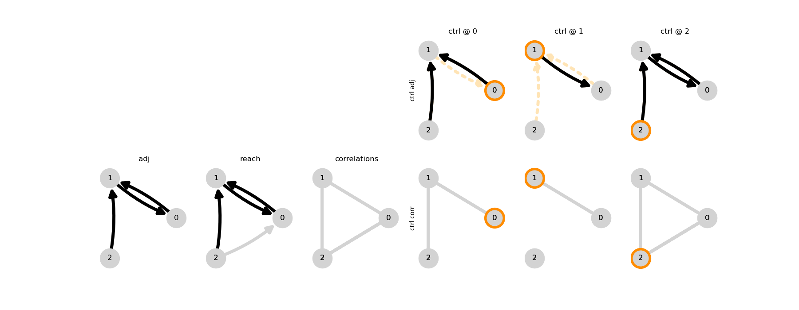
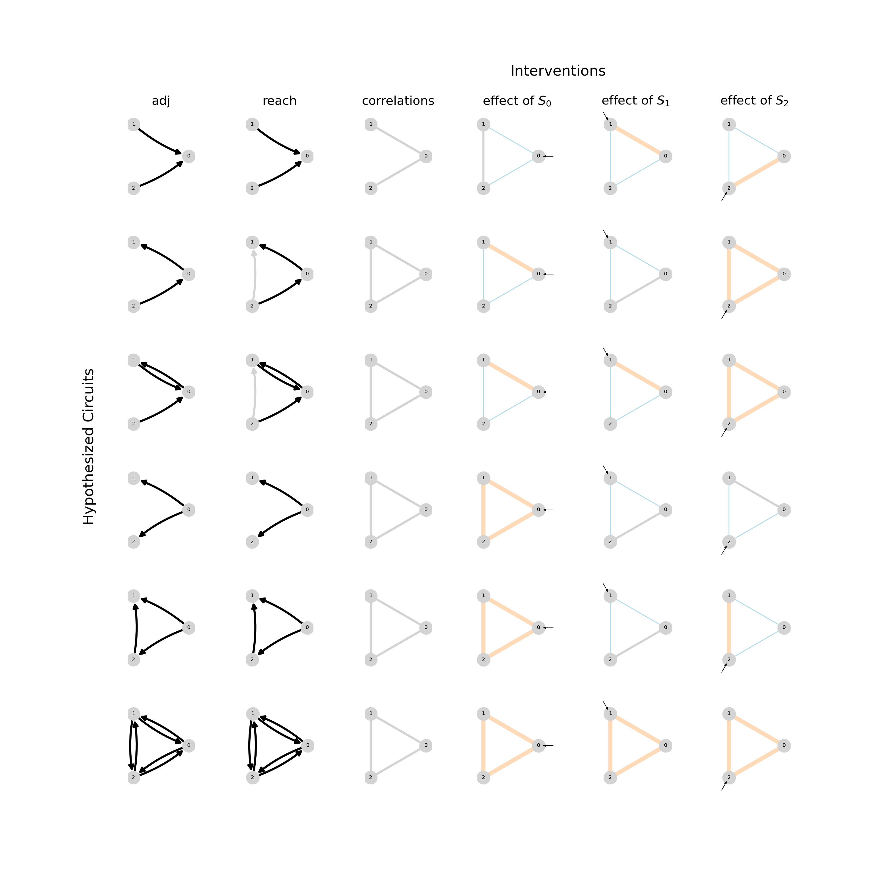

Manuscript for "Closed-Loop Identifiability in Neural Circuits", 
by Adam Willats and Matthew O'Shaugnessy
(work in progress)

# Repo organization
- [manuscript_v*.md](https://github.com/awillats/clinc/blob/main/manuscript_v0.md) - full document for compiling into pdf
- [OUTLINE.md](https://github.com/awillats/clinc/blob/main/OUTLINE.md) - high-level overview of the contents of the manuscript
- [TASKS.md](https://github.com/awillats/clinc/blob/main/TASKS.md) - to-do list
  - see also [project issues](https://github.com/awillats/clinc/projects/1)
- [publish/](https://github.com/awillats/clinc/tree/main/publish) - compiled outputs, like .pdf and .html
- [bib/](https://github.com/awillats/clinc/tree/main/bib) - bibliography files
- [sketch_text/](https://github.com/awillats/clinc/tree/main/sketch_text) - scratchpad for planning and snippets of text

# Code    
Associated code is managed in the following repositories:
- see [awillats/clinc/code](https://github.com/awillats/clinc/code/CODE_OVERVIEW.md) *(this repo)* for simplified network simulations & correlation, reachability theory 
- see [awillats/clinc-gen](https://github.com/awillats/clinc-gen) for network & control simulations  
- see [awillats/brian_delayed_gaussian](https://github.com/awillats/brian_delayed_gaussian) for simulating networks of gaussian nodes with delayed connections 
- see [awillats/clinc-analysis](https://github.com/awillats/clinc-analysis) for network estimation using IDTxl

# Main plots

🚧

# Appendix / supplemental plots

🚧

