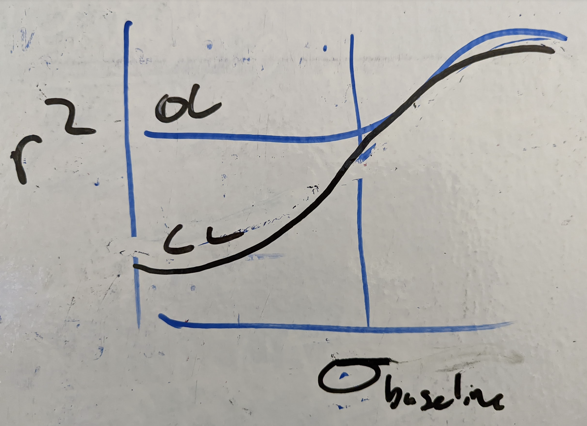

# Top 3 highest priority writing / planning tasks:
- !!!! only worth going so far down any given technical avenue until we decide technical scope for the paper
## quantitative impact - ID-$r^2$
- [~] **extend to impact of closed-loop** - @matt
  - see [IDSNR_notation_matt](sketches_and_notation/identifiability/IDSNR_notation_matt.md) for initial notes
- [x] review/verify matt's R2 formulation    
- [x] **compute dR2 / dSk** - summarize the net effect of intervention at one location 
  - see [gradient_of_r2_demo.m](code/network_analysis/gradient_of_r2_demo.py), uses numerical differentiate to compute $\nabla r^2(S)$
- [x] python implementation
  - [x] of r2 formula
  - [x] of matrix exponential
  - [x] across all edges
  - [x] with input-severing
  - [x] 🍐 PLOT, weighted edges for quant correlation plotting 
  - [ ] 🧵 of sweep script 
    - ( ) look into matched common input weights
  - 🎁 import graph from mermaid or other convenient string format
- [ ] 🧵🎯  demonstrate bi-directional variance control  
  - [ ] ⚠️ add control dg sim
    - [~] merge / verify against matt's sweep 
    - [x] flexible specification of weights
      - see [LinGauss_3node inside brian](https://github.com/awillats/clinc-gen/blob/69d5751ea96bfbffc65b78d8af07f7af37eb882e/small_circuit_scripts/LinGauss_3node/scripts/brian_linear_gaussian_circuits.py)
      
    - [x] separate out baseline / endogenous from applied / open-loop
    - (.) 🎁 fold in Poisson noise   
      - take inspo. from [xcorr-viz](https://github.com/awillats/xcorr-visualizer-p5/blob/main/signal-generation.js)
        - multiPoisson?
  - [ ] ⚠️ add partial incomplete control parameter 
    - simply blends target and un-controlled variance 
    - :gift: implementation writeup?

bonus / future work

- [x] examine R2 = f(w)

- [ ] decompose terms in $r^2$
  - increase interpretability, intuitive understanding 
  - get a sense for when $r^2$ is monotonic w.r.t. source variance, weights

- **followup/verify:** does S+/S- depend on magnitudes of weights 
  - **postulate:** a source increases correlations regardless of quantitative magnitude
    - :warning: incorrect!
  - look at: signs / mixing of signs of weights  

    
## map out hypotheses X interventions
  - [x] quantifying diversity via entropy
    - [x] have python implementation
    - [ ] 🧵 compute across set of hypotheses
      - mostly data-wrangling at this point
    

future work

    
    - [ ] combining multiple interventions
    - [ ] incorporating priors over hypotheses
    

- **2B. [~] compute entropy over hypotheses for given interventions**
  - [x] [.] compute **binary impact of CL**
    - [x] severs inputs 
    - [x] 🍐 PLOT concatenate binary correlations given control to big interventions X hypotheses plot
      - [ ] overlay closed-loop and open-loop interventions 
      - [ ] think about which S to push with ctrl @ i 
    - [ ] ⚠️ bidirectional control of variance w/specific slope between target variance and edge correlation
      - 💡 do target → output and intrinsic→output need to be considered separately 
        - does this mean adding a node to the network representation?
      - S+-, S-+
  - [ ] does CL result in higher entropy, especially for reciprocal circuits?
    
### [.] sketch core figures
  - [~] paste over recent figures
  - [~] paste over abstract, extended abstract into introduction    
  - [ ] ⚠️ meet & reassess writing tasks
    - [ ] ⚠️ writing more methods
    

future work

    - [ ] looking for refs to predict side-band xcorr magnitude
    - [ ] **what about time lags?**  
      - timestep augmented representation?
    

  
## unsorted 
- [ ] port [simple_gaussian_R2.m](code/network_analysis/simple_gaussian_R2.m) to python
  - [ ] sweep pairs of weights to investigate matched weight hypothesis

- [~] connecting to OL ambiguity
  - "if the directed reachability of two circuits is identical, open-loop is insufficient to distinguish. If the directed reachability is non-identical, some (unspecified) combination of open-loop interventions will be sufficient to distinguish"
- [ ] clean up data parsing functions, move to their own file 
- [ ] update python_requirements
  - do an environment export?
- [ ] make use of example_circuits.py - investigate a few more circuits

- ( ) make sure  "Successful Reconstruction of a Physiological Circuit with Known Connectivity from Spiking Activity Alone" is accounted for
---

# planning tasks 
- evaluate scope, potentially combine / cut figures
- how much should this be a perspective / review / prospectus 
  - v.s. focusing on new empirical research results
- decide flow between 
  - params (weight, delay)
  - intervention 
- possible journals 
  - connect with Lepperod/Kording?
  - perspectives 
    - Nature Neuro
  - technical
    - Neuron
    - PLOS Comp Bio
    - JNE 
- **remaining scope**
  - probably
    - linear theory (IDSNR)
    - impact of OL ctrl on IDSNR
    - spiking results
    - open-loop design
  - maybe
    - optimizing closed-loop policy via IDSNR
      - can we do design of experiments without brute-force search of all control locations?
  - probably not 
    - predicting nonlinear case 

# intro / methods tasks
 - [ ] add more closed-loop references to intro[^ctrl_sys_id]
 - [ ] Describe the methods for identifying circuits[^FC_measures][^connect_infer]
  - xcorr procedure 
  - IDTxl recap 
    - cover multivariate transfer entropy 
 - evaluate dimensions of parameter sweeps[^FC_measures]
 - sketch a short review of closed-loop in neuro
  - Grosenick/Deisseroth, Kording 
  
 - [~] write up "tutorial" + latex for different ways of representing a circuit

 [^FC_measures]: "A systematic framework for functional connectivity measures" includes a broad comparison of performance of Granger causality vs transfer entropy vs other methods. also discusses role of weights, noise
 [^connect_infer]: "Connectivity inference from neural recording data: Challenges, mathematical bases and research directions"
 [^ctrl_sys_id]: "A control-theoretic system identification framework and a real-time closed-loop clinical simulation testbed for electrical brain stimulation"

# theory 
- [x] write python to compute via reachability 
- [x] write input → connection notation 
- [~] evaluate python on simple circuit
  - see [code/network_analysis/simple_gaussian_SNR.py](code/network_analysis/simple_gaussian_SNR.py)  

- [ ] 🎁 relate noise → connection SNR to sensitivity transfer function 
  - see [Astrom feedback fundamentals](https://www.cds.caltech.edu/~murray/courses/cds101/fa02/caltech/astrom-ch5.pdf)
- [?] copy over notation from 2020 brainstorming [overleaf link](https://www.overleaf.com/project/5e8232cd6157d200014b52d4)
  - rules for identifiability 
- [ ] 🎁 discuss the role of prior anatomical knowledge in reducing search space 

# formatting tasks 
- add figure references to table of contents  

# organization tasks
- move exemplars to sketches/intro-background ?