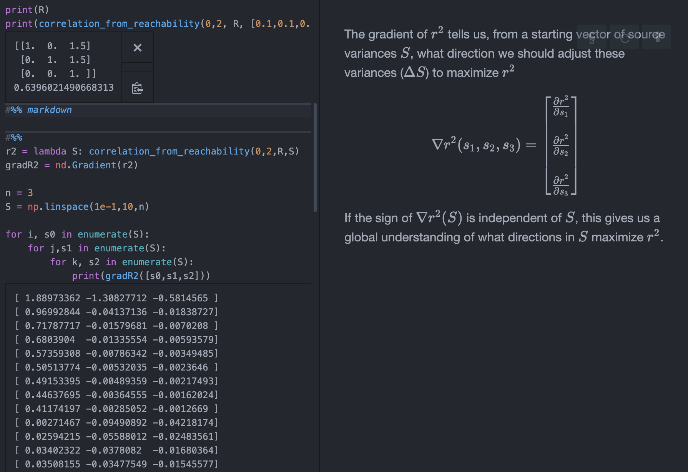

# Purpose / scope

----
# Organization
*see [README.md](../README.md) for more, high-level overview*

## network_analysis/

- `simulation_functions/`  :star:
  - 

sim_simple_network_functions.py

  
    - takes a circuit specification and generates output data
      - generates various forms of random noise
      - uses several ways of "realizing" network dynamics 
        - `sim_contemporaneous`
        $$X^-:=E+Bu  \\X := X^-W$$
          - matrix computation (faster)
          - for-loop computation (more flexible)
        - `sim_dynamic`
        $$X_{t+1} = X_t W + E + Bu$$
  

- `analysis_functions/` :star:
  - 

network_analysis_functions.py

  
    - sever_inputs()
    - reachability_weight()
    - reachability() [binary]
    - closed_loop_reachability()
    - correlation_matrix_from_reachability()
      - correlation_from_reachability()
    

  - network_pattern_entropy.py
    - quantifying how diverse a set of observed correlation patterns are across hypotheses (using Shannon entropy)
  - coreachability_source_classification.py
    - predicting whether a source at a particular location increases or decreases correlation at certain edges

- `circuit_data/`
  - network_data_functions.py - misc. utilities
    - `mermaid_str_to_networkx()` - parses a mermaid-js syntax string to a networkx Graph object
      

demo
  
      
       

    - `nx_to_np_adj()` - extracts numpy adjacency from networkx Graph
  - example_circuits.py - functions for generating sets of circuit hypotheses
  - `motif_data/` - circuit motifs transcribed from other papers

  
- `scripts/` :star:
  - simple_gaussian_SNR.py
  - plot_hypotheses_x_interventions.py
  
- `plotting_functions/`
    - network_plotting_functions.py
    
- `prototyping/`
    - gradient_of_r2_demo.py - $\nabla_S \,{r^2}$
      

demo
  
      
       

      
  
  
- `results/` - output images and tables 
- `_demo_imgs/` - screenshots of progress
  
## MATLAB/
Some early prototype code was written in MATLAB ... 

## _plotting/
eventually plotting functions will get moved here ...

----
