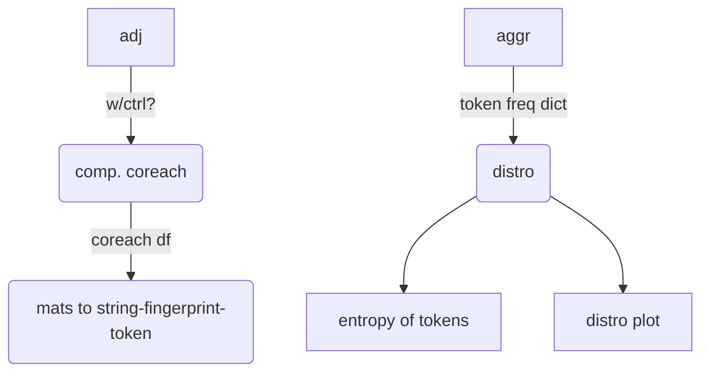
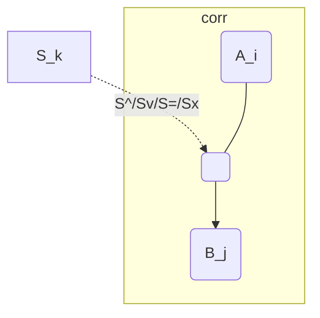

# Current tasks
*see also [technical_tasks](/sketches_and_notation/planning_big_picture/technical_tasks.md)*


## ID-DEMO


generated by [/code/network_analysis/fig_circuit_walkthrough.py](/code/network_analysis/fig_circuit_walkthrough.py)
[CLINC - Figure Demo](https://docs.google.com/drawings/d/1OCqLHdHaLRi24GiD7XOSFU_7EoJ3gZxaVrFdsyMqlHM/edit) - google drawing 
`see /figures/figure_requests.md ` for more details
```shell
topng figures/from_code/demo_circuit_walkthrough.svg 
mv figures/from_code/demo_circuit_walkthrough.png figures/core_figure_sketches/circuit_walkthrough_3circuits_annotated.png
```

<hr>

##Entropy
**big picture goal:** working towards automating


<details><summary>↪pipeline</summary>



---


</details>

<details><summary>↪functions to accomplish these stages:</summary>

- adj 
  - ( modified by severing )
- df of coreach tensor: iA	jB	kS src→corr
  ```python
  df = compute_coreachability_tensor(net.reachability(adj))
  ```
  - e.g. demo_fingerprint.csv
  - redundant directionality removed here on creation so we don't have to think about it at token stage?
  - self-correlation seems to be left in for some reason
    - remove this! so fingerprint will only have 3 ordered subtokens
  - for registering dfs across hypo, maybe it makes sense to have a compact, unique adj ID
- df to compact fingerprint strings:
  - `extract_circuit_signature_single_df()`
- token frequency 
  ```python
  tf = count_unique_frequency(data, do_normalize=True)
  ```
- entropy of tokens 
  ```python
  H = entropy_of_dict(tf, entr_base)
  H_max = max_entropy_of_dict(tf, entr_base)
  ```

</details>


<details><summary>↪<b>entropy files</b></summary>

- `network_pattern_entropy.py`
  - if name main 
- relies on `coreachability_source_classification.py` 
  - to compute coreach tensor
  - `partition_sources_ab()` is core function
- `plot_hypotheses_x_interventions.py`
  - handles plotting infrastructure, layout for left side 
  - but doesn't actually compute anything entropy-related
- `network_data_functions.py`
- 🧿 `analyze_hypothesis_entropy.py`
</details>


### warmup / active
- [ ] :dart: needs infrastructure for storing info associated with each hypothesis
  - but which is also accessible across hypotheses 
    - does this require "wide-format" tables?
  - big table?
    - nested df?
    - or just matrix?
       
### Computing infrastructure 
    
- [ ] extract fingerprint string 
  - for OL - `mostly done`
  - for CL - `do next`
## Hopper 
- [ ] compare binary closed-loop CoReachability to quantitative (see animation idea)
---
## Observations
-  think I can reconstruct the reachability from the open-loop fingerprint! 
  - i.e. with all single-site interventions, can recover (binary) reachability
  - in hindsight, this is probably trivial for theoretical coreach, since this is simply an augmentation of reachability...
    - but this is potentially useful as a recipe for computing reachability from empirical (changes) in correlation 
  - but also note this may depend on influences being excitatory

---
## Bonus features - data processing 
<details><summary>↪- [x] graph to string - string to graph
</summary>  

- see `network_data_functions.graph_components_to_arrow_str()` 
- want something reversible (at least for binary adjacency)
- something relatively compact 
- matrix convention is unlikely to matter
  - likely implies store as edgelist rather than matrix?
proposed solution:
  - `str(G.edges)`
  - `nx.to_pandas_edgelist(G)`
- seems silly to have huge strings as entries for each node 
  - what about multi-level indices?
  - or what about ENUMs which are keys to lookup table of adjacency
    - this has problem of requiring the dictionary to be saved with the csv and not being human readable

</details>

### Plotting 
- [~] plot matrix, w/ circuits as columns 
  - [x] labels off to left side then
  - [x] OL effect on CL correlations
- [~] turns correlations grey?

- [ ] plot building block distro
  - use plotly?
  - [ ] mini graphs on x-axis 
- [ ] write / plot H to the side 
  - profile of H/H_max
  
### Layout 
- way too much going on at once ... 
  - may end up needing to subselect intervention locations 
  
### cleanup 
- fig_hypothesis_entropy.py
  - link image and source file
- review 3b1b

--- 
- 🎯 [x] verify quantitative match
  - doesn't work for partially effective control, otherwise works well
- [ ] additional sweeps for impact on variance:
  - [ ] 🧵 sweep common input
  - [ ] 🧵 sweep w com→B

- [~] get sweep infrastructure
- [ ] misc infrastructure
  - [ ] add functionality for multiple control locations
    - [ ] unify specification of ctrl location, B
    - [ ] save more complete results
  - [ ] improve plot, take whole prediction dictionary as input, plot prediction error
  - [ ] extract data functions to utilities file
- [x] add closed-loop control in `sim_contemporaneous`
  - [~] add partial incomplete control parameter
    - 🧵 quantitative prediction w.r.t control effectiveness
    - 🧵 verify whether this (for-loop) contemp. implementation is sensible 
    - 🧵 gen_gauss used in target needs to be reproducible!
      - not across script runs, but within a script run, needs to use the same target in case ctrl_fn is called multiple times
    - [~] clean up $\bar{W}$ implementation
  - [~] simply blends target and un-controlled variance
    - 🧵 external notions of control effectivness 
    - 🧵 external implementations of control in DGs
  - [ ] 🎁 implementation writeup?
- [ ] 🎁 extend implementations to discrete time dynamics
---
## Organization tasks 
- [ ] continue filling out [CODE_OVERVIEW](CODE_OVERVIEW.md)

## miscellaneous
- [ ] transcribe the following as an operation $$\bar{W} = \sum_{i=1}^{n}W^i \\\,\\ X = X^- \bar{W}$$
  
## observations
- high amplitude open loop control is like high-amplitude closed-loop control