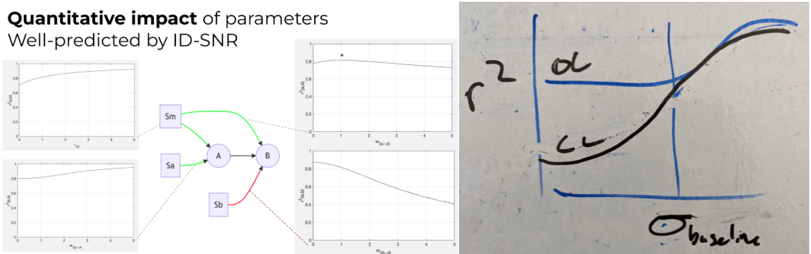

## working towards this figure:

[text for fig here](../section_content/results1_impact_of_intervention.md#fig-var)

---

## Current tasks
*see also [technical_tasks](../sketches_and_notation/planning_big_picture/technical_tasks.md)*
- 🎯 verify quantitative match
- 🎯 [~] get sweep infrastructure

- [.] 🧿 add closed-loop control in `sim_contemporaneous`
  - [~] add partial incomplete control parameter
    - 🧵 quantitative prediction w.r.t control effectiveness
    - 🧵 verify whether this (for-loop) contemp. implementation is sensible 
    - 🧵 gen_gauss used in target needs to be reproducible!
      - not across script runs, but within a script run, needs to use the same target in case ctrl_fn is called multiple times
      

    - [ ] improve plot, take whole prediction dictionary as input, plot prediction error
    - [~] clean up $\bar{W}$ implementation
    - [ ] extract data functions to utilities file
  - [~] simply blends target and un-controlled variance
    - 🧵 external notions of control effectivness 
    - 🧵 external implementations of control in DGs
  - [ ] 🎁 implementation writeup?
- [ ] 🎁 extend implementations to discrete time dynamics
---
## Organization tasks 
- [ ] continue filling out [CODE_OVERVIEW](CODE_OVERVIEW.md)

## miscellaneous
- [ ] transcribe the following as an operation $$\bar{W} = \sum_{i=1}^{n}W^i \\\,\\ X = X^- \bar{W}$$
  