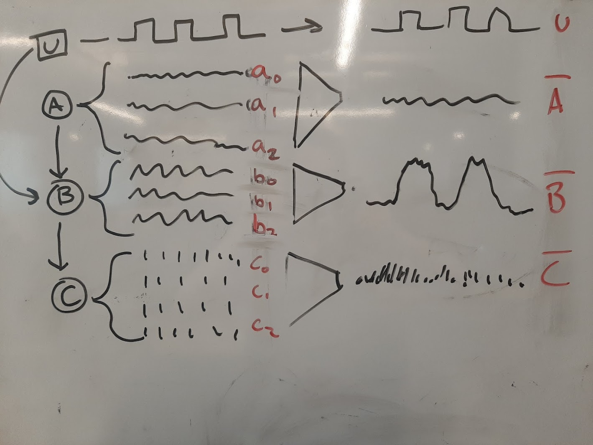

# Insert these figures somewhere

---
# Refine these figures 🚧

# Intro 
## Interventions in Neuro

- merge into causal diagram?
- might be cut if the paper ends up being less

clean up

see also

# Results
## Impact of intervention
- [ ] put source variance on x-axis
- [ ] open and closed-loop loop as color, passive as dotted line

## Impact of circuit properties

---

# Create these figures
