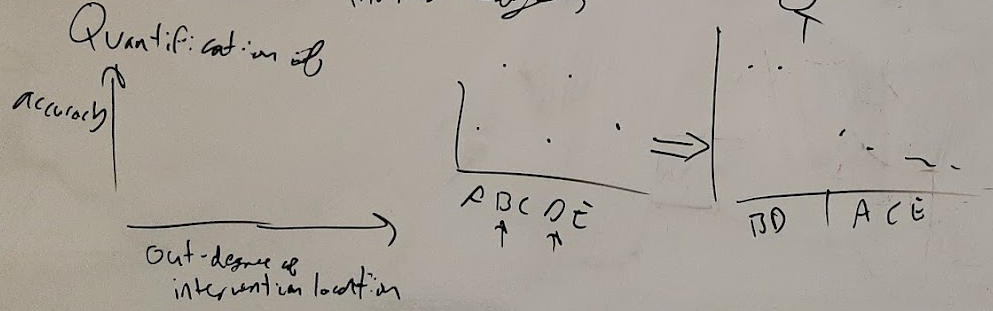
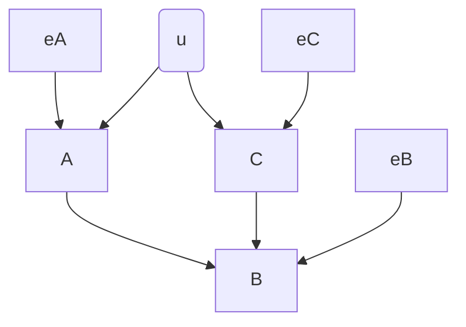

key: 
- ⚠️ start from scratch
- 👨‍💻 minor code update
- 🤖 major technical work 
- 🖊️ detailed illustration
- 🗺️ minor layout changes
- ✂️ potential merge / cut, or not sure whether it will be in scope

--- 
# resources 
- [march 22 aim3-paper figure-edits](https://beta.workflowy.com/#/2b6e1f2371cf)

# TODO
## Most important, least complete figures

- [~] hypothesis entropy figure 
  - [~] tack on summary statistic
  - 🤖 requires some coding to finish
  - 🗺️ will likely require layout iterations
---
## bonus figures 

- [ ] improved data efficiency & bias
  - 🤖🤖 requires major technical work - namely committing to how to turn correlations into circuit inference
  - ✂️ as such, may end up having to cut this
  - ... but if we end up connecting back to the more detailed empirical sims, this will be necessary
  
- [ ] "Extensions" discussion figure 
  - "it works for spiking, with time-delay"

- [ ] extending the graph representation to include quantitative terms 
  - input, output variance 
  - shared v.s. private variance 
  - relevance to neuro

- [ ] flowchart for steps of intervention experiment
  
----

# Intro / background

> **Figure (Interventions in Neuro):** Examples of the role of interventions in discoveries in neuroscience (A) Identifying when a patient is having a seizure, from passive recordings alone (B) through systematic open-loop stimulation experiments, Penfield was able to uncover the spatial organization of how senses and movement are mapped in the cortex [2] (C) Feedback control allows us to specify activity in the brain in terms of outputs. Allows us to reject disturbances, respond to changes
> 🗺️ needs minor illustration cleaning up
> 🖋️ check we can use figures on right or illustration
> *source:* this [google drawing](https://docs.google.com/drawings/d/1letFGuAi145hcUv7OEP0vwAecq-6KH3GrDHlfsla-TI/edit?usp=sharing)
> add puzzle - "where would you intervene to distinguish these hypotheses?" 

↪prior draft

prior draft

## ID DEMO

> **Figure DEMO: Applying CLINC to distinguish a pair of circuits**
> :tada: *(img close to final draft)*
> good enough sketch to write a caption for
> **source:** [google drawing](https://docs.google.com/drawings/d/1OCqLHdHaLRi24GiD7XOSFU_7EoJ3gZxaVrFdsyMqlHM/edit?usp=sharing)

- [ ] TODO: overall this needs to be cut from the caption and filtered into the text body
- [ ] !! add column / row indicators

- feedback from group
  - consider brackets for open-loop identifiable, closed-loop identifiable 
  - add summary column for identifiability relative to set 
    - is open-loop required? is closed-loop required

- could google drawing annotations be moved to python?

### more resources 

↪to do hopper

- [~] find and include frequent circuit (curto + motif)
- [~] wrap circuits we want in `example_circuits.py`
- [ ] alt method of displaying indirect paths?
  - https://networkx.org/documentation/stable/reference/algorithms/generated/networkx.algorithms.simple_paths.all_simple_paths.html#networkx.algorithms.simple_paths.all_simple_paths
  - see also svg_draw !

↪2,3 circuit versions, straight from code

> 3 circuit walkthrough, walkthrough will all intervention locations might be appropriate for the supplement

 ↪more inspiration:

- Combining multiple functional connectivity methods to improve causal inferences
- Advancing functional connectivity research from association to causation
- Fig1. of "Systematic errors in connectivity"

> this figure does a great job of:
> - setting up a key
> - incrementally adding confounds
> - highlighting severed edges
> this figure does NOT
> - explicitly address mutliple hypotheses

**Figure 11: Closed-loop control compensates for inputs to a node in simple circuits:** The left column shows a simple circuit and recording and stimulation sites for an open-loop experiment. The right column shows the functional circuit which results from closed-loop control of the output of region A. Generally, assuming perfectly effective control, the impact of other inputs to a controlled node is nullified and therefore crossed off the functional circuit diagram.

> this figure does a great job of:
> - using a minimal version of the key above
> - showing two competing hypotheses
> - (throughs latent / common modulation in for fun)

**Figure 12: Closed-loop control allows for two circuit hypotheses to be distinguished.** Two hypothesized circuits for the relationships between pyramidal (Pyr, excitatory), parvalbumin-positive (PV, inhibitory), and somatostain-expressing (Som, inhibitory) cells are shown in the two rows. Dashed lines in the right column represent connections whose effects are compensated for through closed-loop control of the Pyr node. By measuring correlations between recorded regions during closed-loop control it is possible to distinguish which hypothesized circuit better matches the data. Notably in the open-loop intervention, activity in all regions is correlated for both hypothesized circuits leading to ambiguity.

↪more notes

probably want
- two circuits which look clearly different
  - ! but which have equivalent reachability
  - possibly with reciprocal connections
  - possssibly with common modulation

- do we need to reflect back from set of possible observations to consistent hypotheses?
  - mention markov equivalence classes explicitly?

- intuitive explanation using binary reachability rules
  <!-- - consider postponing until we introduce intervention?
  - i.e. have one figure that walks through both reachability and impact of intervention -->
- *point to the rest of the paper as deepening and generalizing these ideas*
- *(example papers - Advancing functional connectivity research from association to causation, Combining multiple functional connectivity methods to improve causal inferences)*

- connect **graded reachability** to ID-SNR
  - $\mathrm{IDSNR}_{ij}$ measures the strength of signal related to the connection $i→j$ relative to in the output of node $j$
  - for true, direct connections this quantity increasing means a (true positive) connection will be identified more easily (with high certainty, requiring less data)
  - for false or indirect connections, this quantity increasing means a false positive connection is more likely to be identified
  - as a result we want to maximize IDSNR for true links, and minimize it for false/indirect links

( see also `sketches_and_notation/walkthrough_EI_dissection.md` )

# Theory overview

> **Source:** [google drawing](https://docs.google.com/drawings/d/1rp0UHjsVCUolM5hQLj3dEhqiFzvdaUOqkU1JEC0yBrQ/edit)
> graph theoretic and matrix/dynamics views are related
> - adj→reach→corr 
> - impact of OL, CL
>
>verbally forecast other quantitative considerations
> - indirect effects / confounds
> - estimating connection strength quantitatively
> - CL increases the precision of estimates
> - CL removes/minimizes unrelated sources of variance

> 👨‍💻 needs commitment to concrete time-series data
> 🗺️ needs layout / illustration cleaning up
> but overall, conceptually, close enough to write a caption for

↪prior drafts 

**Optimizing intervention:**

> ⚠️ very loose sketch, need to decide what we want here

---

---

# Simulation methods 
## Network simulations 
## Implementing interventions
## Estimating circuits from data

↪big pile of timeseries methods sketches. for now relying on theory-methods overview pipeline to communicate this

> see also google slides ... 
> 🖋️ something that shows neurons in networks on left side
> ✂️ not sure whether extracting co-dependence and statistical tests will be in scope for the paper

↪see also, xcorr, predicting correlation

---
⚠️🚧 **figure request:** flowchart for steps of intervention experiment 🚧⚠️
see [section_content/_steps_of_inference.md](/section_content/_steps_of_inference.md)
- merge or reference with pipeline overview?

---
# Results
## Impact of intervention

### Intervening provides (categorical) improvements in inference power beyond passive observation

[^difficult-direction]: saying "difficult to distinguish" instead of "indistinguishable" here since the magnitudes of the correlations could also be informative with different assumptions

<!--  -->
> **Figure DISAMBIG: Interventions narrow the set of hypotheses consistent with observed correlations** 
*source: [google drawing](https://docs.google.com/drawings/d/1CBp1MhOW7OGNuBvo7OkIuzqnq8kmN8EEX_AkFuKpVtM/edit)*
>**(A)** Directed adjacency matrices represent the true and hypothesized causal circuit structure
>**(B)** Directed reachability matrices represent the direct *(black)* and indirect *(grey)* influences in a network. Notably, different adjacency matrices can have equivalent reachability matrices making distinguishing between similar causal structures difficult, even with open-loop control.
>**(C)** Correlations between pairs of nodes. Under passive observation, the direction of influence is difficult to ascertain[^difficult-direction]. In densely connected networks, many distinct ground-truth causal structures result in similar "all correlated with all" patterns providing little information about the true structure.
>**(D-F)** The impact of open-loop intervention at each of the nodes in the network is illustrated by modifications to the passive correlation pattern. Thick orange[^edge_color] edges denote correlations which increase above their baseline value with high variance open-loop input. Thin blue[^edge_color] edges denote correlations which decrease, often as a result of increased connection-independent "noise" variance in one of the participating nodes. Grey edges are unaffected by intervention at that location.
> A given hypotheses set (A) will result in an "intervention-specific fingerprint", that is a distribution of frequencies for observing patterns of modified correlations *(across a single row within D-F)*. If this fingerprint contains many examples of the same pattern of correlation (such as **B**), many hypotheses correspond to the same observation, and that experiment contributes low information to distinguish between structures. A maximally informative intervention would produce a unique pattern of correlation for each member of the hypothesis set.
:construction:`caption too long`

↪prev

- [ ] circuit node names need to be more legible?
  - alt. can make it clear in the bracket which node is which
- [ ] needs quant embedding in top right 
- [ ] add row label indicators

### Stronger intervention shapes correlation, resulting in more data-efficient inference with less bias
`Explain why closed-loop helps - bidirectional variance control`
#### Impact of intervention location and variance on pairwise correlations

> 🚧(Caption will need updating after scope, layout updates) **Figure VAR: Location, variance, and type of intervention shape pairwise correlations**
> **(CENTER)** A two-node linear Gaussian network is simulated with a connection from A→B. Open-loop interventions *(blue)* consist of independent Gaussian inputs with a range of variances $\sigma^2_S$. Closed-loop interventions *(orange)* consist of feedback control with an independent Gaussian target with a range of variances. *Incomplete closed-loop interventions result in node outputs which are a mix of the control target and network-driven activity*. Connections from sources to nodes are colored by their impact on correlations between A and B; green denotes $dR/dS > 0$, red denotes $dR/dS<0$.
> **(lower left)** Intervention "upstream" of the connection A→B increases the correlation $r^2(A,B)$.
> **(lower right)** Intervention at the terminal of the connection A→B decreases the correlation $r^2(A,B)$ by adding connection-independent noise.
> **(upper left)** Intervention with shared inputs to both nodes generally increases $r^2(A,B)$, *(even without A→B, see supplement)*.
> **(upper right)** The impact of shared interventions depends on relative weighted reachability $\text{Reach}(S_k→A) / \text{Reach}(S_k→B)$, with highest correlations when these terms are matched (see *)
> Closed-loop interventions *(orange)* generally result in larger changes in correlation across $\sigma^2_S$ than the equivalent open-loop intervention. Closed-loop control at B effectively lesions the connection A→B, resulting in near-zero correlation.
> [^var_compare]
> but may need to layout panels by parts of the circuit like old sketch:

↪old sketch

---
### data efficiency & bias ⚠️
⚠️

> **Figure DATA: Analysis of simulated circuits suggest stronger intervention facilitates identification with less data** [^compare_data_accuracy]

⚠️
> **Figure DATA: Analysis of simulated circuits suggest stronger intervention facilitates identification with less data** [^compare_data_accuracy]
> Explain why closed-loop helps - less bias
> - higher infinite-data accuracy (i.e. less bias)
>    - lower bias likely comes from the categorical advantages above
> - breakdown false positives, false negatives

 figure sketches 

 

---
## Impact of circuit properties ⚠️

- 🤖⚠️ analysis hasn't been written yet! maybe have to be cut 

---
[^var_compare]: compare especially to ["Transfer Entropy as a Measure of Brain Connectivity"](https://www.frontiersin.org/articles/10.3389/fncom.2020.00045/full), ["How Connectivity, Background Activity, and Synaptic Properties Shape the Cross-Correlation between Spike Trains"](https://www.jneurosci.org/content/29/33/10234) Figure 3.

[^compare_data_accuracy]: examples of data efficiency, accuracy figures can be found in: 
"Extending Transfer Entropy Improves Identification of Effective Connectivity in a Spiking Cortical Network Model", 
"Evaluation of the Performance of Information Theory- Based Methods and Cross-Correlation to Estimate the Functional Connectivity in Cortical Networks"n
Fig2. in ["Combining multiple functional connectivity methods to improve causal inferences"](https://www.researchgate.net/publication/337282433_Combining_multiple_functional_connectivity_methods_to_improve_causal_inferences)
---
---
# Discussion
*see especially [value_of_cl_case_studies.md](sketches_and_notation/discussion/value_of_cl_case_studies.md)*
## Hidden confounds 
## Severing loops 
## Direct v.s. indirect effects 

# Supplement 

**shared v.s. private variance**
some variant on:

↪ graph for shared v.s. private sources

- [ ] **Figure:** illustrate reachability *(skip for now?)* - explain how reachability is derived from adjacency

## Prediction v.s. emprirical correlation
- predicting correlation across network parameters

## Contemporaneous v.s. time-resolvable network effects
  

