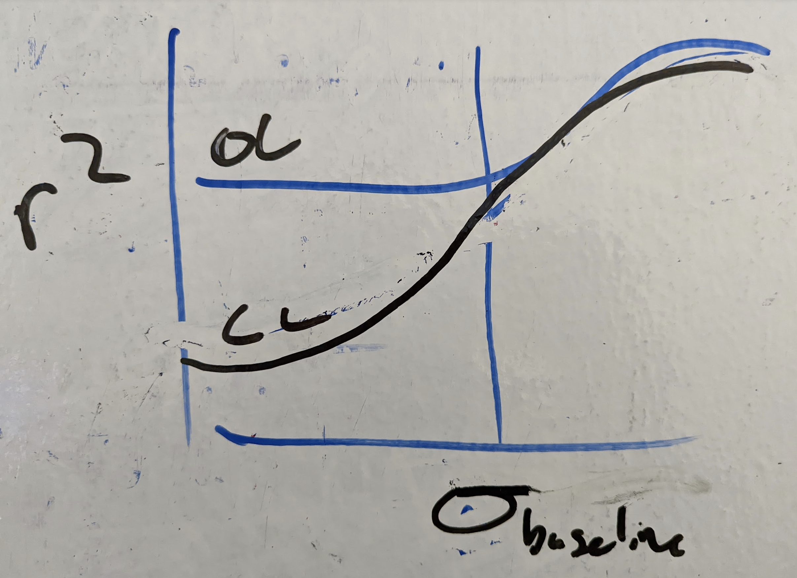

# Insert these figures somewhere

---
# Refine these figures 🚧

# Intro 
- shared v.s. private variance
some variant on:

## Interventions in Neuro

- merge into causal diagram?
- might be cut if the paper ends up being less

clean up

see also

##Figure DEMO: Applying CLINC to distinguish a pair of circuits (walkthrough)

# Methods 
🚧 figure request: flowchart for steps of intervention experiment 🚧
see [section_content/_steps_of_inference.md](/section_content/_steps_of_inference.md)

## Network simulations 
- something that shows neurons in networks

## Extracting circuit estimates

## Implementing interventions

## Predicting correlation structure 
🏞️ **Figure:** illustrate reachability *(skip for now)* 🏞️

# Results
## Impact of intervention
- [ ] put source variance on x-axis
- [ ] open and closed-loop loop as color, passive as dotted line

## Impact of circuit properties

---

# Create these figures
