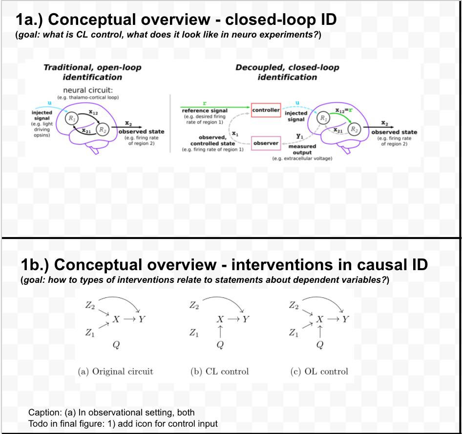
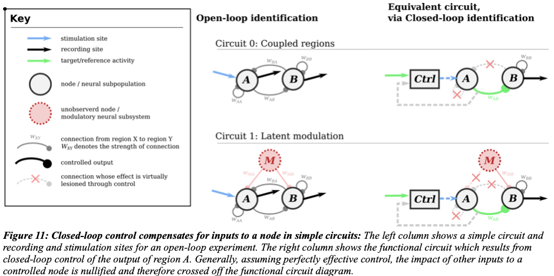
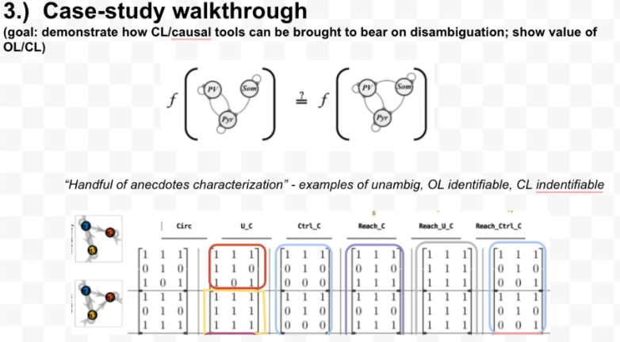

**Title:** ...
**Authors:** Adam Willats, Matt O'Shaughnessy
# Table of Contents 

<!-- @import "[TOC]" {cmd="toc" depthFrom=1 depthTo=6 orderedList=false} -->
<!-- code_chunk_output -->
- [Table of Contents](#table-of-contents)
- [Table of Contents](#table-of-contents)
- [Abstract](#abstract)
- [Introduction](#introduction)
  - [Estimating causal interactions in the brain](#estimating-causal-interactions-in-the-brain)
  - [Interventions in neuroscience & causal inference](#interventions-in-neuroscience-causal-inference)
  - [Representations & reachability](#representations-reachability)
  - [Figure DEMO: Applying CLINC to distinguish a pair of circuits](#figure-demo-applying-clinc-to-distinguish-a-pair-of-circuits)
- [Methods](#methods)
  - [Network simulations](#network-simulations)
  - [Implementing interventions](#implementing-interventions)
  - [Extracting circuit estimates](#extracting-circuit-estimates)
  - [Predicting correlation structure](#predicting-correlation-structure)
  - [Information-theoretic measures of hypothesis ambiguity](#information-theoretic-measures-of-hypothesis-ambiguity)
- [Results](#results)
  - [Impact of node, network parameters on estimation performance](#impact-of-node-network-parameters-on-estimation-performance)
  - [Impact of intervention & circuit structure](#impact-of-intervention-circuit-structure)
- [Discussion](#discussion)
- [References](#references)
- [Supplement](#supplement)
- [Supplement](#supplement)
<!-- /code_chunk_output -->

# Abstract
@import "section_content/abstract.md"
----
# Introduction

## Estimating causal interactions in the brain

@ import "section_content/background_causal_network_id.md"

## Interventions in neuroscience & causal inference
@ import "section_content/background_intervention_neuro.md"
@ import "section_content/background_intervention_causal_inf.md"

## Representations & reachability
@ import "section_content/background_representation_reach.md"

<!--  -->
<!--  -->
## Figure DEMO: Applying CLINC to distinguish a pair of circuits
<!-- @ import "section_content/background_id_demo.md" -->

----
# Methods

## Network simulations
## Implementing interventions
## Extracting circuit estimates
## Predicting correlation structure 
## Information-theoretic measures of hypothesis ambiguity

----

# Results
<!-- ## Characterizing circuit-pair ambiguity through reachability properties -->
## Impact of node, network parameters on estimation performance

<!-- ## Impact of intervention on estimation performance -->
## Impact of intervention & circuit structure

----

# Discussion
# References
# Supplement
