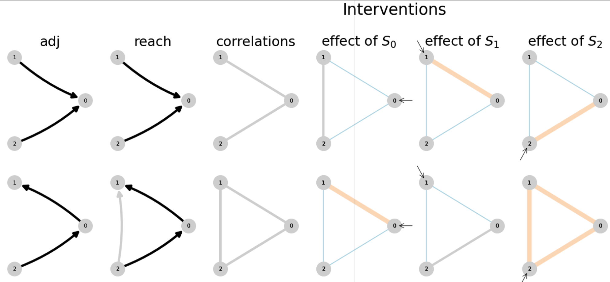

**Title:** ...
**Authors:** Adam Willats, Matt O'Shaughnessy
# Table of Contents 

<!-- @import "[TOC]" {cmd="toc" depthFrom=1 depthTo=6 orderedList=false} -->
<!-- code_chunk_output -->
- [Table of Contents](#table-of-contents)
- [Table of Contents](#table-of-contents)
- [Abstract](#abstract)
- [Introduction](#introduction)
  - [Estimating causal interactions in the brain](#estimating-causal-interactions-in-the-brain)
  - [Interventions in neuroscience & causal inference](#interventions-in-neuroscience-causal-inference)
  - [Representations & reachability](#representations-reachability)
- [Representations](#representations)
  - [Reachability](#reachability)
  - [Understanding identification through derived properties of circuits (reachability rules)](#understanding-identification-through-derived-properties-of-circuits-reachability-rules)
  - [Figure DEMO: Applying CLINC to distinguish a pair of circuits](#figure-demo-applying-clinc-to-distinguish-a-pair-of-circuits)
- [Theory / Prediction](#theory-prediction)
  - [Computing reachability (theory)](#computing-reachability-theory)
  - [Predicting correlation structure (theory)](#predicting-correlation-structure-theory)
- [Simulation](#simulation)
  - [Network simulations (simulation)](#network-simulations-simulation)
  - [Implementing interventions (simulation)](#implementing-interventions-simulation)
  - [Extracting circuit estimates (empirical)](#extracting-circuit-estimates-empirical)
  - [Information-theoretic measures of hypothesis ambiguity](#information-theoretic-measures-of-hypothesis-ambiguity)
- [Results](#results)
  - [Interaction of intervention on circuit estimation](#interaction-of-intervention-on-circuit-estimation)
    - [Intervening provides (categorical) improvements in inference power beyond passive observation](#intervening-provides-categorical-improvements-in-inference-power-beyond-passive-observation)
    - [Stronger intervention results in more efficient, accuracy inference](#stronger-intervention-results-in-more-efficient-accuracy-inference)
    - [Related sections](#related-sections)
  - [Interaction of intervention & circuit structure](#interaction-of-intervention-circuit-structure)
- [Discussion](#discussion)
- [References](#references)
- [Supplement](#supplement)
- [Supplement](#supplement)
<!-- /code_chunk_output -->

# Abstract
@import "section_content/abstract.md"
----
# Introduction

## Estimating causal interactions in the brain

@ import "section_content/background_causal_network_id.md"

## Interventions in neuroscience & causal inference
@ import "section_content/background_intervention_neuro.md"
@ import "section_content/background_intervention_causal_inf.md"

## Representations & reachability
@import "section_content/background_representation_reach.md"

<!--  -->
<!--  -->
## Figure DEMO: Applying CLINC to distinguish a pair of circuits
<!-- @ import "section_content/background_id_demo.md" -->

----
# Theory / Prediction 

## Computing reachability (theory)
## Predicting correlation structure (theory)

@import "section_content/methods1_predicting_correlation.md"

----
# Simulation

## Network simulations (simulation)

## Implementing interventions (simulation)

## Extracting circuit estimates (empirical)
@import "section_content/methods0_simulations_interventions_estimates.md"

## Information-theoretic measures of hypothesis ambiguity
@import "section_content/methods2_hypothesis_entropy.md"

----

# Results
<!-- ## Characterizing circuit-pair ambiguity through reachability properties -->
<!-- ## Impact of node, network parameters on estimation performance -->

## Interaction of intervention on circuit estimation
<!-- ## Impact of intervention on estimation performance -->
@import "section_content/results1_impact_of_intervention.md"

## Interaction of intervention & circuit structure
@import "section_content/results2_circuit_x_intervention.md"

----

# Discussion
# References
# Supplement
