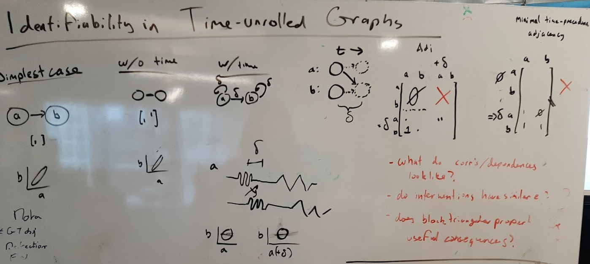
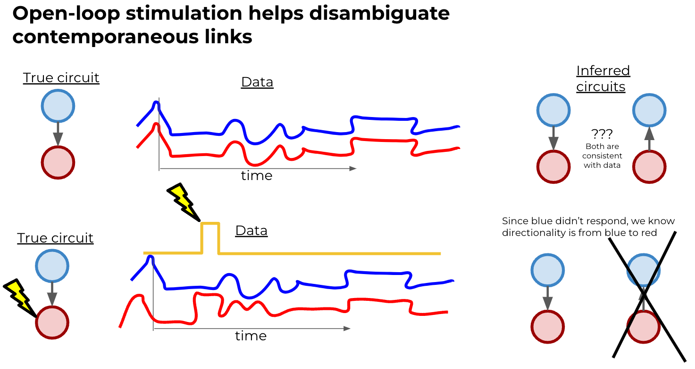
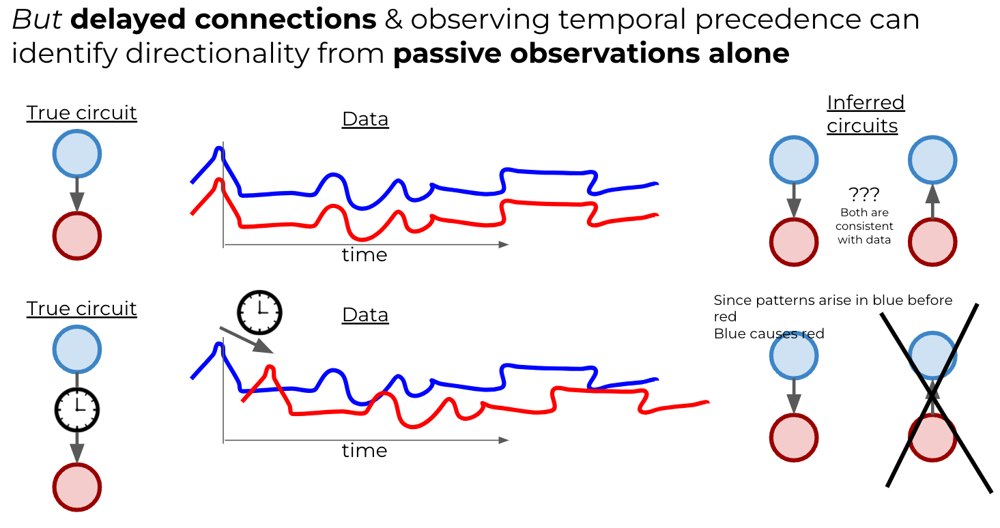

Our goal is to develop clean answers, phrased in neuro terms, to the following questions:
- Given a pair of neural circuits, is it possible to disambiguate them using observational data, or is open- or closed-loop control needed?  If control is needed, where should it be applied?
- Given a fixed control budget and some kind of ranking of potential causal links we'd like to uncover, where should control be applied, and how much inference power do we have?
- How do these answers change in the face of **imperfect** control (for example, when other observed or unobserved variables still have some limited effect on the circuit)?

## To be integrated elsewhere - binary impact of closed-loop
- we already know CL @ i severs the inputs to i
  - following the classes S+, S-, S0, we’d call this something like Sx or SKO
- but depending on the variance of the closed-loop target you can also have bidirectional control on edge correlations.
  - however, just like open loop inputs can have a “sign” (they either increase or decrease correlation (but not both) at an edge), closed-loop control has a “slope sign”
  - if closed-loop control at Si has a “positive variance slope” at an edge (A→B), increasing the variance of the target increases the correlation at an edge (same as open-loop S+) and decreasing the variance of the target decreases the correlation (potentially below its baseline levels unlike open-loop)
  - if closed-loop control at Si has a “negative variance slope” at an edge (A→B) the opposite is true.
  - i might call these classes S+- and S-+ respectively
  - if open-loop stim results in S+ at an edge, I think closed-loop control results in S+- at that same edge
- [ ] add this to python implementation

## Open methodological questions

see also

- **time-resolved versus contemporaneous** inference domains
  - Contemp.: $\Delta_{sample} \approx \delta_{syn}$
    - categorical factors may matter more
      - intervention has a more categorical impact
  - Time-resolvable: $\Delta_{sample} \ll \delta_{syn}$
    - generally, 
    - quantitative factors may matter more
    - reciprocal connections put an upper bound on resolvable $\delta_{syn}$
      - $\Delta_{sample} \ll \delta_{syn} < \tau_{recurrent}$
      

[^assess]: "The measures implemented are: mutual information, conditional mutual information, Granger causality, and conditional Granger causality (each for univariate and multivariate linear-Gaussian processes). For completeness we have also included Pearson correlation and partial correlation for univariate processes (with a potentially multivariate conditional process)."

- map of techniques available for inference
  - see ["Assessing the Significance of Directed and Multivariate Measures of Linear Dependence Between Time Series"](https://arxiv.org/pdf/2003.03887.pdf), [code](https://github.com/olivercliff/assessing-linear-dependence)[^assess] and [Unifying Pairwise Interactions in Complex Dynamics](https://arxiv.org/abs/2201.11941)
  - bivariate v.s. multivariate 
  - conditioning
    - same signals past 
    - other signals 
    - on stimulus
  - measures of dependence 
    - correlation
      - partial correlation
      - time-lagged cross-correlation
    - granger causality
    - mutual information
    - transfer entropy
    
- tighter integration of knowledge of intervention into network estimation procedure 
  - stimulus-conditional transfer entropy 

- how does circuit structure imply impact of intervention?
  - decrease independent variance at terminals
  - increase variance at sources
  - interrupt indirect connections to reveal direct causal structure
  

- do we care about **permutations of circuits** as distinct entities?

- how to integrate recent "per intervention location" identifiability with prior "per intervetnion type" results ?

- verify Reach(Ctrl(A @ k)) != Ctrl(Reach(A) @ k)

- look into **r^2 as f(w)** function of homogenous weight parameter 
  - or w_shared and w_independent

- does this generalize to circuits with negative weights?
  
- how much does **time-varying stimulus** help?
  
- does parameter heterogeneity matter?  
  
- do **self-connections** matter?
  - currently we're implicitly adding in self connections

- in the 2-node case, can it be shown that closed-loop control gives 2-bits of information
  - rather than the 1-bit info granted by single open-loop sim
  - may require correlating required inputs with outputs of other nodes
    - how to capture this in theory ...
  - would like for there to be benefits without "reverse engineer" correlations

- how to "back calculate" adjacency matrices consistent with a given reachability?
  - d-separation!

- is there a way of investigating whether the **need for closed-loop increases with (circuit features)**
  - especially reciprocal motifs
  - increases density
  - dominant higher-order effects (larger weights)

- can we derive a formula for number of perturbations needed to fully disambiguate a circuit?
  - see [modular biological compexity](https://www.science.org/doi/10.1126/science.1218616) via Kumar et al.
  \[
  B_N = \sum^{N-1}_{k=0} \frac{(N-1)!}{k!(N-1-k)}B_k
  \]
  
- effect of joint/multiple open-loop stim
  

- how to **decompose intervention effect** into effect on subgraphs, motifs

- should we be computing **partial correlation**?
  - how do we describe their impact on observed corr?
- should we be computing **effect of node knockout**?
  - severs outputs
- how to we "integrate" inference - i.e. combine results from multiple intervention conditions to arrive at a refined hypothesis?
- **how to predict/describe the impact of delays on SNR** 
  - time-augmented representation?

- is it useful to sum component-wise identifiability across nodes → net identifiability?
  - what about dR2 / dSk
  
- connect quotient vector product form of SNR calculations to existing model structures
  - does this connect to transfer functions in Laplace domain for instance?

- is the distinction between reachability and controlability relevant?
  - [see discussion here](https://math.stackexchange.com/questions/3030305/what-is-the-difference-between-controllability-and-reachability)
- should a node be considered reachable from itself?
  - would splitting nodes into Sin | Sout help make this clearer
- do we need to consider "fork-shaped" reachability?

## to read/think about pile 
- field of "Structural identifiability"
[jkbren/netrd](https://github.com/jkbren/netrd)
- a library for reconstruction, comparison and dynamics on networks
  - works closely with networkx