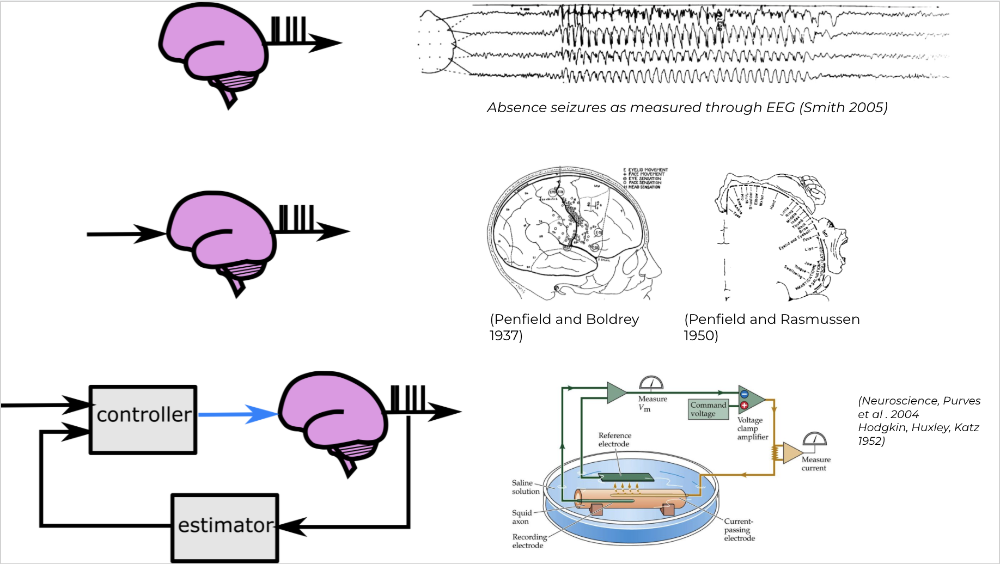
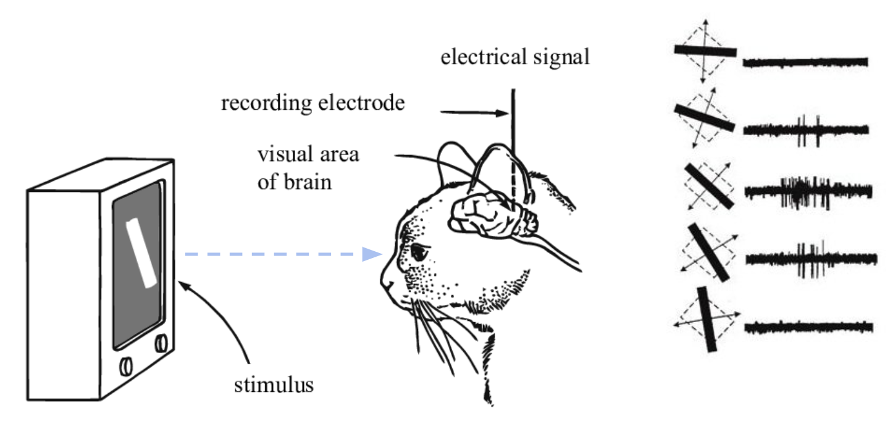

## Outline
- core idea is that "stronger" interventions lead to "higher inferential power"
  - may mean identifying circuits with less data
  - but may also mean distinguishing circuits which may have been "observationally equivalent" under weaker interventions
- **Highlight that the impact of interventions may generalize across any particular choice of inference algorithm**
- different effect of intervention types

## See also
  - [notation1_circuits.md](../sketches_and_notation/notation/notation1_circuits.md)
  - [notation2_do_calculus.md](../sketches_and_notation/notation/notation2_do_calculus.md)
  - [notation3_pearl.md](../sketches_and_notation/notation/notation3_pearl.md)

## Draft

A rich theoretical literature has confirmed the central role of interventions in inferring causal structure from data \cite{pearl2009causality, eberhardt2007interventions}. Consistent with intuition from neuroscience literature, data in which some variables are experimentally intervened on is typically much more powerful than observational data alone. For example, observational data of two correlated variables $x$ and $y$ does not allow a scientist to determine whether $x$ is driving $y$, $y$ is driving $x$, or if the two variables are being independently driven by a hidden confounder. Experimentally manipulating $x$ and observing the output of $y$, however, allows the scientist to begin to establish which potential causal interaction pattern is at work.

> **Fig: Examples of the role of interventions in discoveries in neuroscience**  (A) Identifying when a patient is having a seizure, from **passive recordings** alone (B) through **systematic open-loop stimulation experiments,** Penfield was able to uncover the spatial organization of how senses and movement are mapped in the cortex [^HW] (C) **Feedback control** allows us to specify activity in the brain in terms of outputs. Allows us to reject disturbances, respond to changes

[^HW]: Another great example of open-loop mapping: Hubel, D.H., Wiesel, T.N.: Receptive fields of single neurones in the cat’s striate cortex. The Journal of physiology 148(3), 574–591 (1959)

[^specific]: probably needs to get more specific sooner, @Adam can fill in

Certain interventions can provide much more inferential power than others.[^specific] Interventions on some portions of a system may allow more information about the system's causal structure than interventions in other areas. Interventions are also more valuable when they more precisely change the system: "perfect" interventions that set the behavior of part of the system exactly to a desired state provide more information than "soft" interventions that only partially manipulate a part of the system.

[^precise]: @Adam - make this more precise. talk about spatial, temporal degrees of freedom

In real-world neuroscience settings, experimenters are faced with deciding between interventions that differ in both of these regards. For example, stimulation can often only be applied to certain regions of the brain [^precise]. And while experimenters may be able to exactly manipulate activity in some parts of the brain using closed-loop control (akin to a "perfect" intervention), in other locations experimenters may only be able to apply open-loop control that perturbs a part of the system but can not manipulate its activity exactly to a desired state (a "soft" intervention).

[^simplify]: @Matt this needs breaking down

Although theoretical guarantees and algorithms designed to choose among these interventions are often designed for simple models with strong assumptions on properties such as the types of functional relationships that exist in circuits, the visibility and structure of confounding relationships, and noise statistics, they provide guidance that can that can help practitioners design experiments that provide as much scientific insight as possible[^simplify] \cite{ghassami2018budgeted,yang2018characterizing}. Importantly, the necessity and inferential power of interventions is often \emph{algorithm-independent}, in the sense that there exist interventions that reveal causal structure that would be impossible for \emph{any} algorithm to infer from observational data alone \cite{shanmugam2015learning}.

In this paper, we take a theoretically- and experimentally-motivated approach to analyzing the ability of neurally-plausible open- and closed-loop interventions to provide information about the causal structure of neural circuits.
