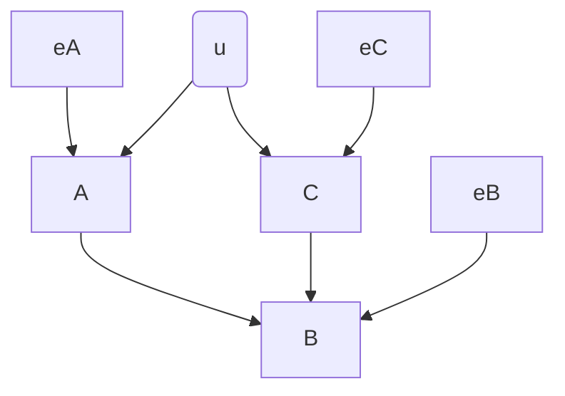
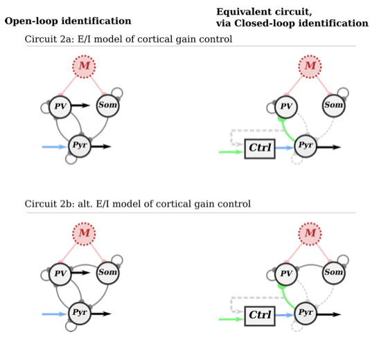
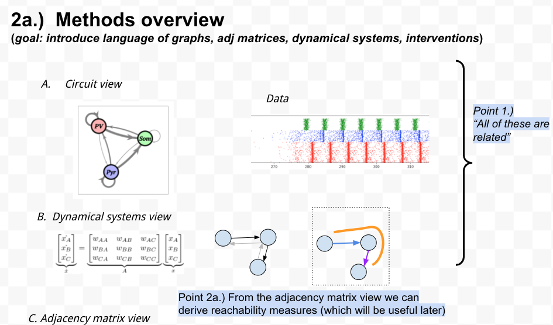
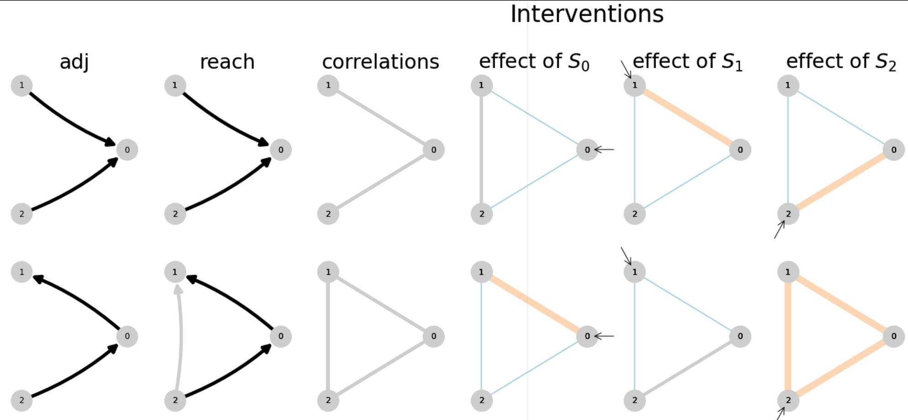

[^exog]: the most important property of $e$ for the math to work, i believe, is that they're random variables independent of each other. This is not true in general if E is capturing input from common sources, other nodes in the network. I think to solve this, we'll need to have an endogenous independent noise term and an externally applied (potentially common) stimulus term.
[^sim_repr]: have to be careful with this. this almost looks like a dynamical system, but isn't. In simulation we're doing something like an SCM, where the circuit is sorted topologically then computed sequentially. And then I'm

Different mathematical representations of circuits can elucidate different connectivity properties. For example, consider the circuit $A \rightarrow B \leftarrow C$. This circuit can be modeled by the dynamical system
\[
\begin{cases}
\dot{x}_A &= f_A(e_A) \\
\dot{x}_B &= f_B(x_A, x_C, e_B) \\
\dot{x}_C &= f_C(e_C),
\end{cases}
\]
where $e_A$, $e_B$, and $e_C$ represent exogenous inputs that are inputs from other variables and each other[^exog].

When the system is linear we can use matrix notation to denote the impact of each node on the others. Denote the $p \times n$ matrix of data samples by $X$ and the $p \times n$ matrix of exogenous input values by $E$. We can then write[^sim_repr]
\[
X = X W + E,
\]

<!-- 

alt.
 -->

Topologically sorted implementation:
$$\begin{align}
X^- &:= E\\
X &:= X^-W + E
\end{align}$$
<!-- 
 -->

where $W$ represents the *adjacency matrix*
\[
W = \begin{bmatrix}
    w_{AA} & w_{AB} & w_{AC} \\
    w_{BA} & w_{BB} & w_{BC} \\
    w_{CA} & w_{CB} & w_{CC}
\end{bmatrix}.
\]
In the circuit $A \rightarrow B \leftarrow C$, we would have $w_{AB} \neq 0$ and $w_{CB} \neq 0$.

The adjacency matrix captures directional first-order connections in the circuit: $w_{ij}$, for example, describes how activity in $x_j$ changes in response to activity in $x_i$.

Our goal is to reason about the relationship between underlying causal structure (which we want to understand) and the correlation or information shared by pairs of nodes in the circuit (which we can observe). Quantities based on the  adjacency matrix and weighted reachability matrix bridge this gap, connecting the causal structure of a circuit to the correlation structure its nodes will produce.

The directional $k^{\mathrm{th}}$-order connections in the circuit are similarly described by the matrix $W^k$, so the *weighted reachability matrix*
\[
    \widetilde{W} = \sum_{k=0}^{\infty} W^k
\]
describes the total impact --- through both first-order (direct) connections and higher-order (indirect) connections --- of each node on the others. Whether node $j$ is "reachable" (Skiena 2011) from node $i$ by a direct or indirect connection is thus indicated by $\widetilde{W}_{ij} \neq 0$, with the magnitude of $\widetilde{W}_{ij}$ indicating sensitive node $j$ is to a change in node $i$.

This notion of reachability, encoded by the pattern of nonzero entries in $\widetilde{W}$, allows us to determine when two nodes will be correlated (or more generally, contain information about each other). Moreover, as we will describe in Sections [REF] and [REF], quantities derived from these representations can also be used to describe the impact of open- and closed-loop interventions on circuit behavior, allowing us to quantitatively explore the impact of these interventions on the identifiability of circuits.

`[Matt to Adam --- I like the idea of an example here, but the details will likely need to change once the neighboring intro sections take shape]`

Consider, for example, the hypotheses for cortical gain control in open-loop (Figure BACKGROUND>REPRESENTATION/REACH-1, left column). In both circuit 2a and 2b, PV cells are reachable from the Som cell node ($\widetilde{W}_{PV \to Som} \neq 0$), since Som activity can influence PV activity indirectly through the Pyr node. These circuits are therefore difficult to distinguish under open-loop intervention.

If the reachability of two circuits are unequal for a given intervention, differences in correlation between observed regions will be sufficient to distinguish between the two hypotheses. Looking at these same circuits under closed-loop control of the pyramidal population (Figure BACKGROUND>REPRESENTATION/REACH-1, right column), dashed lines reveal that there is no longer an indirect functional connection from Som to PV cells. As such, in circuit 2a, PV cells are no longer reachable from the Som population, whereas they are reachable under circuit 2b. This difference in reachability corresponds to the difference in correlational structure that allows us to distinguish these two hypotheses under closed-loop control.

**Figure BACKGROUND>REPRESENTATION/REACH-1: Closed-loop control allows for two circuit hypotheses to be distinguished.** Two hypothesized circuits for the relationships between pyramidal (Pyr, excitatory), parvalbumin-positive (PV, inhibitory), and somatostain-expressing (Som, inhibitory) cells are shown in the two rows. Dashed lines in the right column represent connections whose effects are compensated for through closed-loop control of the Pyr node. By measuring correlations between recorded regions during closed-loop control it is possible to distinguish which hypothesized circuit better matches the data. Notably in the open-loop intervention, activity in all regions is correlated for both hypothesized circuits leading to ambiguity.

!!!! - more figures

<!--  -->
<!--  -->