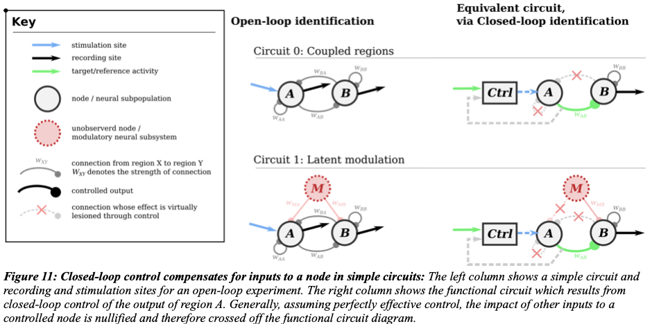

### New content here

Different mathematical representations of circuits can elucidate different connectivity properties. For example, consider the circuit $A \rightarrow B \leftarrow C$. This circuit can be modeled by the dynamical system
\[
\begin{cases}
\dot{x}_A &= f_A(e_A) \\
\dot{x}_B &= f_B(x_A, x_C, e_B) \\
\dot{x}_C &= f_C(e_C),
\end{cases}
\]
where $e_A$, $e_B$, and $e_C$ represent exogenous inputs that are inputs from other variables and each other.

When the system is linear we can use matrix notation to denote the impact of each node on the others. Denote the $p \times n$ matrix of data samples by $X$ and the $p \times n$ matrix of exogenous input values by $E$. We can then write
\[
X = X W + E,
\]
where $W$ represents the *adjacency matrix*
\[
W = \begin{bmatrix}
    w_{AA} & w_{AB} & w_{AC} \\
    w_{BA} & w_{BB} & w_{BC} \\
    w_{CA} & w_{CB} & w_{CC}
\end{bmatrix}.
\]
In the circuit $A \rightarrow B \leftarrow C$, we would have $w_{AB} \neq 0$ and $w_{CB} \neq 0$.

The adjacency matrix describes the behavior of directional first-order connections in the circuit: $w_{ij}$, for example, describes how activity in $x_j$ changes in response to activity in $x_i$. It is easy to show that directional $k^{\mathrm{th}}$-order connections are described by the matrix $W^k$, and so the *weighted reachability matrix*
\[
    \widetilde{W} = \sum_{k=0}^{\infty} W^k
\]
describes the total impact --- through both direct first-order connections and indirect higher-order connections --- of each node on the others. The presence of a directed link from node $i$ to node $j$ --- whether direct or indirect --- is indicated by $\widetilde{W}_{ij} \neq 0$. This representation allows us to determine when data observed from two nodes will contain information about each other or be correlated.

Our goal is to reason about how underlying causal structure in the circuit (which we want to understand) impacts the correlation structure or information shared by pairs of nodes (which we can observe). As we will describe in Sections [REF] and [REF], the weighted reachability matrix can be used to describe the impact of open- and closed-loop interventions on circuit behavior. Moreover, the weighted reachability matrix allows us to predict which nodes' signals will be correlated. When combined, these expressions allow us to use

### Old content here

**Reachability**
- concept of **binary reachability** as a "best case scenario" for identification.
  - binary reachability describes which pairs of nodes we expect to have any correlation
  - can be used to predict "equivalence classes", i.e. circuits which may be indistinguishable under certain interventions
  - how binary reachability is computed
    - [...equations here...]
- **graded reachability** can help predict the influence of parameter values (e.g. edge weights, time-constants) on identifiability
  - quantifies impact of inputs, noise on outputs
  - easiest to describe/understand in linear-gaussian setting
  - [...equations here...]

**Understanding identification through derived properties of circuits (reachability rules)**
  - connect **binary reachability** to classes of ambiguity
    - a pair of networks are ambiguous (given some intervention) if they are in the same markov equivalence class
    - ambiguity x intervention leads to the following classes
      - passively unambiguous
      - open-loop unambiguous
      - (single-site) closed-loop unambiguous

**Text from proposal**
To perform this evaluation, I used a simple derived quantity of the circuit’s adjacency matrix: its reachability (Skiena 2011). This quantity measures which nodes can be “reached” by direct and indirect connections starting from a target node. Moreover, this measure allows us to predict which node’s signals will be correlated. If the reachability of two circuits are equal, they will have similar correlational structure and be difficult to distinguish with that level of intervention. For instance looking at hypotheses for cortical gain control in open-loop (Figure 12, left column), in both circuit 2a and 2b, PV cells are reachable from the Som cell node since Som activity can influence PV activity indirectly through the Pyr node. As such these circuits cannot be distinguished in open loop.

If the reachability of two circuits are unequal for a given intervention, differences in correlation between observed regions will be sufficient to distinguish between the two hypotheses. Looking at these same circuits under closed-loop control of the pyramidal population (Figure 12, right column), dashed lines reveal that there is no longer an indirect functional connection from Som to PV cells. As such, in circuit 2a, PV cells are no longer reachable from the Som population, whereas they are reachable under circuit 2b. This difference in reachability corresponds to the difference in correlational structure that allows us to distinguish these two hypotheses under closed-loop control.

**Some figures**

**Figure 11: Closed-loop control compensates for inputs to a node in simple circuits:** The left column shows a simple circuit and recording and stimulation sites for an open-loop experiment. The right column shows the functional circuit which results from closed-loop control of the output of region A. Generally, assuming perfectly effective control, the impact of other inputs to a controlled node is nullified and therefore crossed off the functional circuit diagram.

**Figure 12: Closed-loop control allows for two circuit hypotheses to be distinguished.** Two hypothesized circuits for the relationships between pyramidal (Pyr, excitatory), parvalbumin-positive (PV, inhibitory), and somatostain-expressing (Som, inhibitory) cells are shown in the two rows. Dashed lines in the right column represent connections whose effects are compensated for through closed-loop control of the Pyr node. By measuring correlations between recorded regions during closed-loop control it is possible to distinguish which hypothesized circuit better matches the data. Notably in the open-loop intervention, activity in all regions is correlated for both hypothesized circuits leading to ambiguity.
