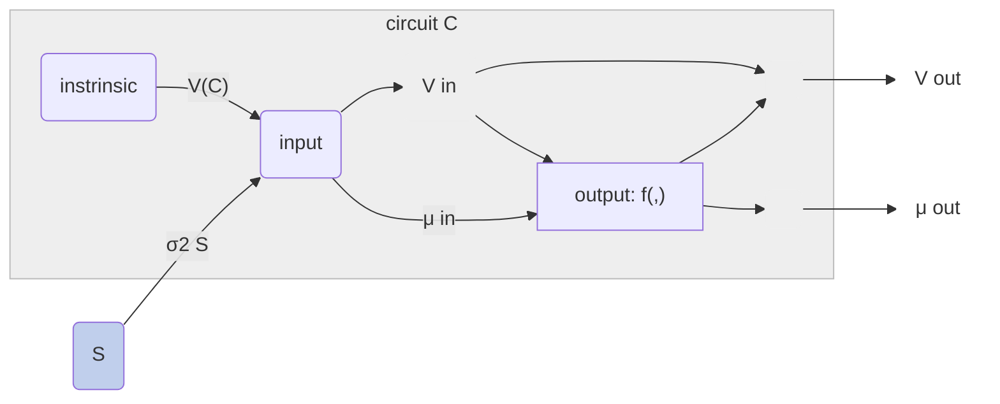

going to assume these have already been discussed

- predicting correlation
- measuring dependence
- markov equivalence

[^node_repr]: nodes in such a graphical model may represent populations of neurons, distinct cell-types, different regions within the brain, or components of a latent variable represented in the brain.

- [x] [x][ ] quick readthrough, round out `structure of an experiment`
  - moved to _steps_of_inference.md
- [x] [ ] 20 minutes scaffolding quantitative section
- [ ] 20 minutes on Figure DISAMBIG
  - write caption freeform
- [ ] why link severing

---

### Intervening provides (categorical) improvements in inference power beyond passive observation
@ import "_steps_of_inference.md"
----
!!!! - Application to demo set, entropy over hypotheses - 10% done
Next, we apply (steps 1-3 of) this circuit search procedure to a collection of closely related hypotheses for 3 interacting nodes[^node_repr] to illustrate the impact of intervention. 

**Figure DISAMBIG: Stronger intervention facilitates disambiguating equivalent hypotheses**
- lay out rows
- lay out columns 
- draw attention to "sameness" of correlations row
- explain color scheme
  - grey for indirect edges 
  - color1 for increasing correlation
  - color2 for decreasing correlation 
  - color3 for severed edges
- explain distribution across hypothesis for a given intervention
  - build intuition for "more different circuits = better inference"

!!!! - Explain why closed-loop helps - link severing - 5% done
`this is probably redundant with intro`

**Why does closed-loop control provide a categorical advantage?** Because it severs indirect links

`this is has to be backed up by aggregate results:`
- this is especially relevant in recurrently connected networks where the reachability matrix becomes more dense. 
- more stuff is connected to other stuff, so there are more indirect connections, and the resulting correlations look more similar (more circuits in the equivalence class)
- patterns of correlation become more specific with increasing intervention strength 
  - more severed links → more unique adjacency-specific patterns of correlation  
  
> **Where you intervene**[^where_place] strongly determines the inference power of your experiment.

[^where_place]: Figure VAR shows this pretty well, perhaps sink this section until after discussing categorical and quantitative?

> **secondary point:** having (binary) prediction helps capture this relationship

---

!!!! - Quantitative impact of closed-loop - 10% done
### Stronger intervention shapes correlation, resulting in more data-efficient inference with less bias
> - "here are the quantitative advantages"
> - "here's additional nuance"
> - wider range of observable correlations
>   - important because we sometimes want to minimize correlations for indirect links
>   - allows for more distinct outcomes w.r.t. circuit
>   - summarized as "closed-loop allows bidirectional control of variance"
> - higher infinite-data accuracy (i.e. less bias)
>    - lower bias likely comes from the categorical advantages above
> - less data required to get to threshold level of accuracy (more data-efficient)
>      - likely comes from improved "SNR" which can be thought of as a derived property of the per-edge correlations
> - breakdown false positives, false negatives
> - (quantitative prediction helps)
<!-- Figure DATA: Analysis of simulated circuits suggest stronger intervention facilitates identification with less data  -->

!!!! - Explain why closed-loop helps - bidirectional variance control - 40% done

[^intrinsic_var]: below the level set by added, independent/"private" sources
>- while you can deliver open-loop inputs with titrated amounts of variance, you're often only able to add variance rather than subtract it, and the amount of variance you would add to the system is hard to predict a priori
>- this is a key advantage of closed-loop control
>  - which can have bidirectional influence over variance  

  
While a primary advantage of closed-loop interventions for circuit inference is its ability to functionally lesion indirect connections, another, more nuanced `(quantitative)` advantage of closed-loop control lies in its capacity to bidirectionally control output variance. While the variance of an open-loop stimulus can be titrated to adjust the output variance at a node, in general, an open-loop stimulus cannot reduce this variance below its instrinsic[^intrinsic_var] variability. That is, if the system is linear with gaussian noise,
$$\mathbb{V}_{i}(C|S=\text{open},\sigma^2_S) \geq \mathbb{V}_{i}(C)$$
More specifically, if the open-loop stimulus is statistically independent from the intrinsic variability[^open_loop_independent]
$$\mathbb{V}_{i}(C|S=\text{open},\sigma^2_S) = \mathbb{V}_{i}(C) + \sigma^2_S$$
Applying closed-loop to a linear gaussian circuit:

\[
\begin{align}
\mathbb{V}_{i}(C|S=\text{closed},\sigma^2_S) &= \sigma^2_S \\
\mathbb{V}_{i}(C|S=\text{closed},\sigma^2_S) &\perp \mathbb{V}_{i}(C)
\end{align}
\]

 ↪ Firing rates couple mean and variance 
 

In neural circuits, we're often interested in firing rates, which are non-negative. This particular output nonlinearity means that the linear gaussian assumptions do not hold, especially in the presence of strong inhibitory inputs. In this setting, firing rate variability is coupled to its mean rate; Under a homoeneous-rate Poisson assumption, mean firing rate and firing rate variability would be proportional. With inhibitory inputs, open-loop stimulus can drive firing rates low enough to reduce their variability. Here, feedback control still provides an advantage in being able to control the mean and variance of firing rates independently[^cl_indp_practical]

↪ messy diagram, work in progress 

\[
\begin{align}
\mu^{out}_i &= f(\mu^{in}_i, \mathbb{V}^{in}_i)\\
\mathbb{V}^{out}_{i}(C) &= f(\mu^{out}_i, \mathbb{V}^{in}_i)
\end{align}
\]

 ↪ Notes on imperfect control 
 

`Ideal control`
\[
\mathbb{V}_{i}(C|S=\text{closed},\sigma^2_S) = \sigma^2_S 
\]
`Imperfect control` - intuitively feedback control is counteracting / subtracting disturbance due to unobserved sources, including intrinsic variability. We could summarize the effectiveness of closed-loop disturbance rejection with a scalar $0\leq\gamma\leq1$
\[
\mathbb{V}_{i}(C|S=\text{closed},\sigma^2_S) = \mathbb{V}_{i}(C) - \gamma\mathbb{V}_{i}(C) + \sigma^2_S \\
\mathbb{V}_{i}(C|S=\text{closed},\sigma^2_S) = (1-\gamma) \mathbb{V}_{i}(C) + \sigma^2_S
\]

[^open_loop_independent]: notably, this is part of the definition of open-loop intervention
[^cl_indp_practical]: practically, this requires very fast feedback to achieve fully independent control over mean and variance. In the case of firing rates, I suspect $\mu \leq \alpha\mathbb{V}$, so variances can be reduced, but for very low firing rates, there's still an upper limit on what the variance can be.

`Implications for ID: more precise shaping of codependence across network`
- `variance of node may increase or decrease correlation of pair of nodes`

**Figure VAR: Stronger intervention allows better control of covariance**
**shaping covariance**

    
- having (quantitative) prediction helps capture this relationship
  
  - **Figure PREDICT: Comparing predicted and empirical correlation, identification performance**
  

!!!! - Explain why closed-loop helps - less bias - 5% done
> - higher infinite-data accuracy (i.e. less bias)
>    - lower bias likely comes from the categorical advantages above

!!!! - Explain why closed-loop helps - more data efficient - 5% done

 figure sketches 

 

> Figure DATA: Analysis of simulated circuits suggest stronger intervention facilitates identification with less data 

[^bonus_causal]: **[future work]** use causality + graph theory to find "lurking look-alikes" i.e. Markov-equivalent circuits
[^more_assumptions]: should also enumerate assumptions about the dynamics of the network, signs of network weights, approximate timescales of interaction.