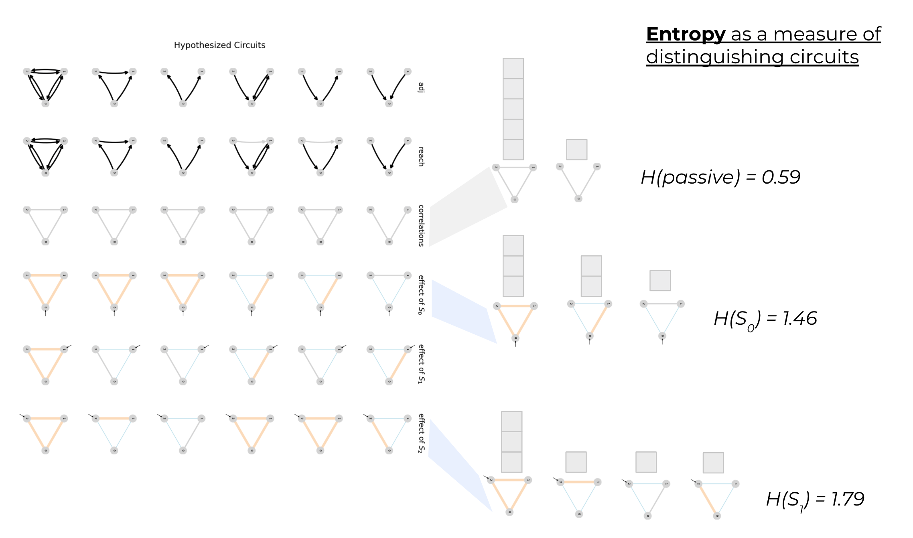
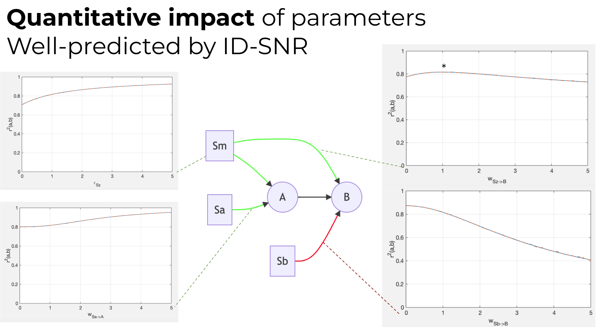
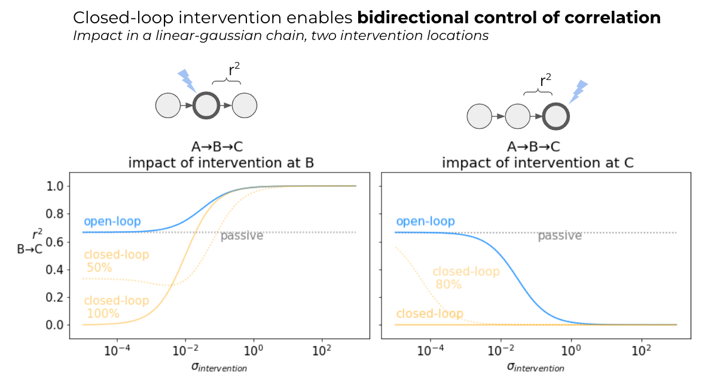
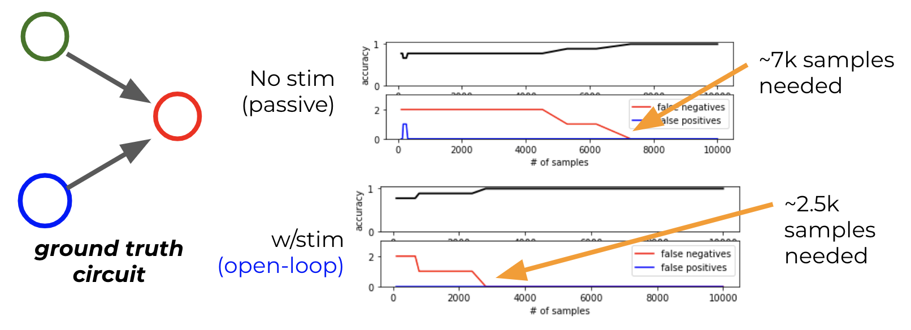
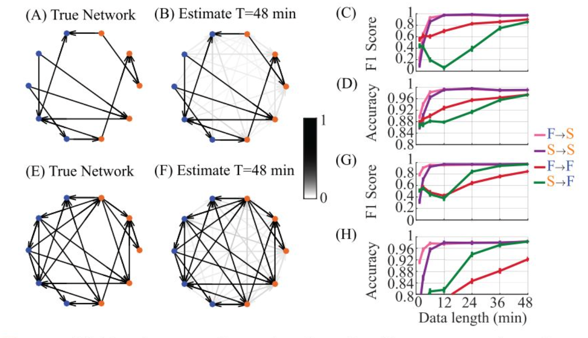

going to assume these have already been discussed

- predicting correlation
- measuring dependence
- markov equivalence

[^node_repr]: nodes in such a graphical model may represent populations of neurons, distinct cell-types, different regions within the brain, or components of a latent variable represented in the brain.

<!-- - [ ] why link severing - difficult, might leave to later -->

---

### Intervening provides (categorical) improvements in inference power beyond passive observation

[Methods: Procedure for choosing & applying intervention](_steps_of_inference.md)

----
!!!! - Application to demo set, entropy over hypotheses - 50% done
Next, we apply (steps 1-3 of) this circuit search procedure to a collection of closely related hypotheses for 3 interacting nodes[^node_repr] to illustrate the impact of intervention. 🚧 `most of the story in the figure caption for now` 🚧

> **Figure DISAMBIG: Interventions narrow the set of hypotheses consistent with observed correlations** 
>**(A)** Directed adjacency matrices represent the true and hypothesized causal circuit structure
>**(B)** Directed reachability matrices represent the direct *(black)* and indirect *(grey)* influences in a network. Notably, different adjacency matrices can have equivalent reachability matrices making distinguishing between similar causal structures difficult, even with open-loop control.
>**(C)** Correlations between pairs of nodes. Under passive observation, the direction of influence is difficult to ascertain. In densely connected networks, many distinct ground-truth causal structures result in similar "all correlated with all" patterns providing little information about the true structure.
>**(D-F)** The impact of open-loop intervention at each of the nodes in the network is illustrated by modifications to the passive correlation pattern. Thick orange[^edge_color] edges denote correlations which increase above their baseline value with high variance open-loop input. Thin blue[^edge_color] edges denote correlations which decrease, often as a result of increased connection-independent "noise" variance in one of the participating nodes. Grey edges are unaffected by intervention at that location.
> A given hypotheses set (A) will result in an "intervention-specific fingerprint", that is a distribution of frequencies for observing patterns of modified correlations *(across a single row within D-F)*. If this fingerprint contains many examples of the same pattern of correlation (such as **B**), many hypotheses correspond to the same observation, and that experiment contributes low information to distinguish between structures. A maximally informative intervention would produce a unique pattern of correlation for each member of the hypothesis set.
:construction:`caption too long`

<!-- - purpose of the figure 
  - conclusion: stronger intervention facilitates disambiguating equivalent hypotheses
    - more distinct patterns in a row 
    - few hypotheses have equivalent patterns
- explain distribution across hypothesis for a given intervention
  - build intuition for "more different circuits = better inference" -->

[^edge_color]: will change the color scheme for final figure. Likely using orange and blue to denote closed and open-loop interventions. Will also add in indication of severed edges

!!!! - Explain why closed-loop helps - link severing - 5% done

**Why does closed-loop control provide a categorical advantage?** Because it severs indirect links
`is this redundant with intro?`
`needs to be backed here up by aggregate results?`
- this is especially relevant in recurrently connected networks where the reachability matrix becomes more dense. 
- more stuff is connected to other stuff, so there are more indirect connections, and the resulting correlations look more similar (more circuits in the equivalence class)
- patterns of correlation become more specific with increasing intervention strength 
  - more severed links → more unique adjacency-specific patterns of correlation  
  
> **Where you intervene**[^where_place] strongly determines the inference power of your experiment.
> **secondary point:** having (binary) prediction helps capture this relationship

[^where_place]: Figure VAR shows this pretty well, perhaps sink this section until after discussing categorical and quantitative?
---

!!!! - Quantitative impact of closed-loop - 70% done
### Stronger intervention shapes correlation, resulting in more data-efficient inference with less bias

!!!! - Explain why closed-loop helps - bidirectional variance control - 40% done
[^dof]: need a more specific way of stating this. I mean degrees of freedom in the sense that mean and variance can be controlled independent of each other. And also, that the range of achievable correlation coefficients is wider for closed-loop than open-loop (where instrinsic variability constrains the minimum output variance)
  
[^intrinsic_var]: below the level set by added, independent/"private" sources
  
While a primary advantage of closed-loop interventions for circuit inference is its ability to functionally lesion indirect connections, another, more nuanced `(quantitative)` advantage of closed-loop control lies in its capacity to bidirectionally control output variance. While the variance of an open-loop stimulus can be titrated to adjust the output variance at a node, in general, an open-loop stimulus cannot reduce this variance below its instrinsic[^intrinsic_var] variability. That is, if the system is linear with gaussian noise,
$$\mathbb{V}_{i}(C|S=\text{open},\sigma^2_S) \geq \mathbb{V}_{i}(C)$$
More specifically, if the open-loop stimulus is statistically independent from the intrinsic variability[^open_loop_independent]
$$\mathbb{V}_{i}(C|S=\text{open},\sigma^2_S) = \mathbb{V}_{i}(C) + \sigma^2_S$$
Applying closed-loop to a linear gaussian circuit:

\[
\begin{align}
\mathbb{V}_{i}(C|S=\text{closed},\sigma^2_S) &= \sigma^2_S \\
\mathbb{V}_{i}(C|S=\text{closed},\sigma^2_S) &\perp \mathbb{V}_{i}(C)
\end{align}
\]

 ↪ Firing rates couple mean and variance 
 

In neural circuits, we're often interested in firing rates, which are non-negative. This particular output nonlinearity means that the linear gaussian assumptions do not hold, especially in the presence of strong inhibitory inputs. In this setting, firing rate variability is coupled to its mean rate; Under a homoeneous-rate Poisson assumption, mean firing rate and firing rate variability would be proportional. With inhibitory inputs, open-loop stimulus can drive firing rates low enough to reduce their variability. Here, feedback control still provides an advantage in being able to control the mean and variance of firing rates independently[^cl_indp_practical]

\[
\begin{align}
\mu^{out}_i &= f(\mu^{in}_i, \mathbb{V}^{in}_i)\\
\mathbb{V}^{out}_{i}(C) &= f(\mu^{out}_i, \mathbb{V}^{in}_i)
\end{align}
\]

 ↪ Notes on imperfect control 
 

`Ideal control`
\[
\mathbb{V}_{i}(C|S=\text{closed},\sigma^2_S) = \sigma^2_S 
\]
`Imperfect control` - intuitively feedback control is counteracting / subtracting disturbance due to unobserved sources, including intrinsic variability. We could summarize the effectiveness of closed-loop disturbance rejection with a scalar $0\leq\gamma\leq1$
\[
\mathbb{V}_{i}(C|S=\text{closed},\sigma^2_S) = \mathbb{V}_{i}(C) - \gamma\mathbb{V}_{i}(C) + \sigma^2_S \\
\mathbb{V}_{i}(C|S=\text{closed},\sigma^2_S) = (1-\gamma) \mathbb{V}_{i}(C) + \sigma^2_S
\]

[^open_loop_independent]: notably, this is part of the definition of open-loop intervention
[^cl_indp_practical]: practically, this requires very fast feedback to achieve fully independent control over mean and variance. In the case of firing rates, I suspect $\mu \leq \alpha\mathbb{V}$, so variances can be reduced, but for very low firing rates, there's still an upper limit on what the variance can be.

!!!! - reference [figvar](#fig-var) to empricially show this bidirectional control of output variance?

#### Impact of intervention location and variance on pariwise correlations
<!-- > - Implications for ID: more precise shaping of codependence across network
> - wider dynamic range of observable correlations
>   - important because we sometimes want to minimize correlations for indirect links
>   - allows for more distinct outcomes w.r.t. circuit -->

[related methods](methods1_predicting_correlation.md)

We have shown that closed-loop interventions provide more flexible control over output variance of nodes in a network, and that shared and independent sources of variance determine pairwise correlations between node outputs. Together, this suggests closed-loop interventions may allow us to shape the pattern of correlations with more degrees of freedom[^dof] `[why do we want to?...]`

One application of this increased flexibility [...] is to increase correlations associated with pairs of directly correlated nodes, while decreasing spurious correlations associated with pairs of nodes without a direct connection (but perhaps are influenced by a common input, or are connected only indirectly). This manipulation may bring the observed pattern of correlations  

Our hypothesis is that this shaping of pairwise correlations will result in reduced false positive edges in inferred circuits, "unblurring" the indirect associations that would otherwise confound circuit inference. However care must be taken, as this strategy relies on a hypothesis for the ground truth adjacency and may also result in a "confirmation bias" as new spurious correlations can be introduced through closed-loop intervention.

The impact of intervention on correlations can be summarized through the co-reachability $\text{CoReach}(i,j|S_k)$. A useful distillation of this mapping is to understand the sign of $\frac{dR_{ij}}{dS_k}$, that is whether increasing the variance of an intervention at node $k$ increases or decreases the correlation between nodes $i$ and $j$

In a simulated network A→B [(fig. variance)](#fig-var) we demonstrate predicted and emprirical correlations between a pair of nodes as a function of intervention type, location, and variance. A few features are present which provide a general intuition for the impact of intervention location in larger circuits: First, interventions "upstream" of a true connection [(lower left, fig. variance)](#fig-var) tend to increase the connection-related variance, and therefore strengthen the observed correlations.
$$\text{Reach}(S_k→i) \neq 0 \\ \text{Reach}(i→j) \neq 0 \\ \frac{dR}{dS_k} > 0$$

Second, interventions affecting only the downstream node [(lower right, fig. variance)](#fig-var) of a true connection introduce variance which is independent of the connection A→B, decreasing the observed correlation.
$$\text{Reach}(S_k → j) = 0 \\ \text{Reach}(S_k → j) \neq 0 \\ \frac{dR}{dS_k} < 0$$

Third, interventions which reach both nodes will tend to increase the observed correlations [(upper left, fig. variance)](#fig-var), moreover this can be achieved even if no direct connection $i→j$ exists.
$$\text{Reach}(S_k → i) \neq 0 \\ \text{Reach}(S_k → j) \neq 0 \\ \text{Reach}(i → j) = 0 \\ \frac{dR}{dS_k} > 0$$

Notably, the impact of an intervention which is a "common cause" for both nodes depends on the relative weighted reachability between the source and each of the nodes. Correlations induced by a common cause are maximized when the input to each node is equal, that is $\widetilde{W}_{S_k→i} \approx \widetilde{W}_{S_k→j}$ (upper right * in [fig. variance](#fig-var)). If i→j are connected $\widetilde{W}_{S_k→i} \gg \widetilde{W}_{S_k→j}$ results in an variance-correlation relationship similar to the "upstream source" case (increasing source variance increases correlation $\frac{dR}{dS_k} > 0$),
 while $\widetilde{W}_{S_k→i} \ll \widetilde{W}_{S_k→j}$ results in a relationship similar to the "downstream source" case ($\frac{dR}{dS_k} < 0$)[^verify_drds]

[^verify_drds]: not 100% sure this is true, the empirical results are really pointing to dR/dW<0 rather than dR/dS<0. Also this should really be something like $\frac{d|R|}{dS}$ or $\frac{dr^2}{dS}$ since these effects decrease the *magnitude* of correlations. I.e. if $\frac{d|R|}{dS} < 0$ increasing $S$ might move $r$ from $-0.8$ to $-0.2$, i.e. decrease its magnitude not its value.

<!--  -->

> **Figure VAR: Location, variance, and type of intervention shape pairwise correlations**
> **(CENTER)** A two-node linear gaussian network is simulated with a connection from A→B. Open-loop interventions *(blue)* consist of independent gaussian inputs with a range of variances $\sigma^2_S$. Closed-loop interventions *(orange)* consist of feedback control with an independent gaussian target with a range of variances. *Incomplete closed-loop interventions result in node outputs which are a mix of the control target and network-driven activity*. Connections from sources to nodes are colored by their impact on correlations between A and B; green denotes $dR/dS > 0$, red denotes $dR/dS<0$.
> **(lower left)** Intervention "upstream" of the connection A→B increases the correlation $r^2(A,B)$.
> **(lower right)** Intervention at the terminal of the connection A→B decreases the correlation $r^2(A,B)$ by adding connection-independent noise.
> **(upper left)** Intervention with shared inputs to both nodes generally increases $r^2(A,B)$, *(even without A→B, see supplement)*.
> **(upper right)** The impact of shared interventions depends on relative weighted reachability $\text{Reach}(S_k→A) / \text{Reach}(S_k→B)$, with highest correlations when these terms are matched (see *)
> Closed-loop interventions *(orange)* generally result in larger changes in correlation across $\sigma^2_S$ than the equivalent open-loop intervention. Closed-loop control at B effectively lesions the connection A→B, resulting in near-zero correlation.
> [^var_compare]

[^var_compare]: compare especially to ["Transfer Entropy as a Measure of Brain Connectivity"](https://www.frontiersin.org/articles/10.3389/fncom.2020.00045/full), ["How Connectivity, Background Activity, and Synaptic Properties Shape the Cross-Correlation between Spike Trains"](https://www.jneurosci.org/content/29/33/10234) Figure 3.

↪ additional notes:

- contextualize increasing correlation is sometimes good, sometimes bad!
- having (quantitative) prediction helps capture this relationship
- **(incidental) subfigure PREDICT: Comparing predicted and empirical correlation, identification performance**

🚧
The change in correlation as a function of changing intervention variance ($\frac{dr^2_{ij}}{dS}$) can therefore be used as an additional indicator of presence/absence and directionality of the connection between A,B *(see [fig. disambig. D.)](fig-disambig))*
🚧

[Fig. variance](#fig-var) also demonstrates the relative dynamic range of correlations achievable under passive, open- and closed-loop intervention. In the passive case, correlations are determined by instrinsic properties of the network $\sigma^2_{base}$. These properties have influence over the observed correlations in a way that can be difficult to separate from differences due to the ground-truth circuit. With open-loop intervention we can observe the impact of increasing variance at a particular node, but the dynamic range of achievable correlations is bounded by not being able to reduce variance below its baseline level. With closed-loop control, the bidirectional control of the output variance for a node means a much wider range of correlations can be achieved [(blue v.s. orange in fig. variance)](#fig-var), resulting in a more sensitive signal reflecting the ground-truth connectivity.

!!!! - Explain why closed-loop helps - more data efficient - 5% done
> - less data required to get to threshold level of accuracy (more data-efficient)
>      - likely comes from improved "SNR" which can be thought of as a derived property of the per-edge correlations
🚧

 figure sketches 

 

> Figure DATA: Analysis of simulated circuits suggest stronger intervention facilitates identification with less data [^compare_data_accuracy]

[^compare_data_accuracy]: "Extending Transfer Entropy Improves Identification of Effective Connectivity in a Spiking Cortical Network Model", "Evaluation of the Performance of Information Theory- Based Methods and Cross-Correlation to Estimate the Functional Connectivity in Cortical Networks"

!!!! - Explain why closed-loop helps - less bias - 5% done
> - higher infinite-data accuracy (i.e. less bias)
>    - lower bias likely comes from the categorical advantages above
> - breakdown false positives, false negatives
🚧

[^bonus_causal]: **[future work]** use causality + graph theory to find "lurking look-alikes" i.e. Markov-equivalent circuits
[^more_assumptions]: should also enumerate assumptions about the dynamics of the network, signs of network weights, approximate timescales of interaction.