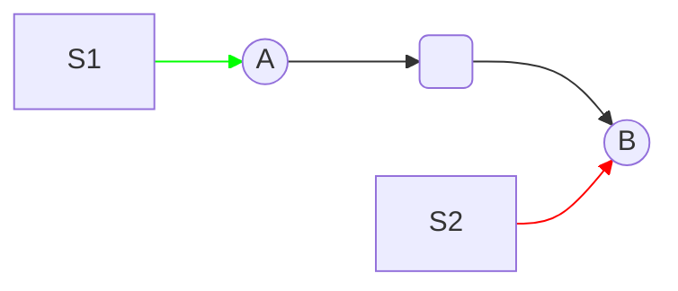
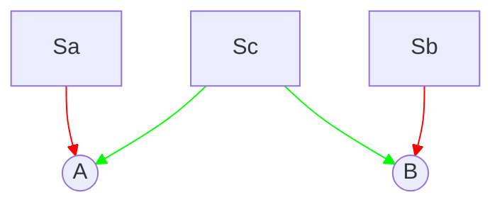

# High-level concept
We want to know how inputs delivered a certain location (S) in a network impact the observed connection strength (A→B).
This is useful to us because it helps us predict the impact of noise levels (input variance) on the strength of observed correlations - which leads to higher likelihood of inferring a connection.
This quantity, which we're calling ID-SNR[^term] is something we hope to maximize for true direct causal links, and minimize for indirect & confounded links.

Knowing the relationship between exogenous noise and correlation should allow us to design a profile of open-loop stimulation with tuned noise properties to optimize ID-SNR across the network

[^term]: now that we know this is essentially just a correlation coefficient, we need to consider updating our name for this

# Simple example

looking at the connection A→→B, signals shared in common between A and B will increases the strength of the observed correlation.
- In the case where A drives B, directly or indirectly (A→→B), inputs which drive B, but *not* A (such as S2 above) will introduce an independent noise source which will **decrease** the observed correlation between A,B.
- In this same case A→→B, any inputs which increase variance of A will lead to a stronger common single between A,B since this shared single "flow downstream" to B. In the circuit above, this means increasing the variances of S1 will increase the observed correlation between A,B.


# Quantifying impact
$$
\begin{align*}
r(i,j) &= \frac{\Sigma_{ij}}{\sqrt{\Sigma_{ii} \Sigma_{jj}}} \\
&= \frac{\sum_{k=1}^p \widetilde{W}_{ki} \widetilde{W}_{kj} s_k}{\sqrt{\left(\sum_{k=1}^p \widetilde{W}_{ki}^2 s_k\right)\left(\sum_{k=1}^p \widetilde{W}_{kj}^2 s_k\right)}}.
\end{align*}
$$
$s_k$ - variance at source location $k$

## Code implementations
**Python:**
```python    
def correlation_from_reachability(i,j, Wt , s):
    Wi = Wt[:,i]
    Wj = Wt[:,j]
    r2_numer = sum(Wi*Wj*s)
    r2_denom = np.sqrt(sum(Wi**2 * s) * sum(Wj**2 * s))
    return r2_numer / r2_denom 
```
**MATLAB:**
```matlab
function r2 = correlation_from_reachability(i,j,Wt,s)
    Wi = Wt(:,i);
    Wj = Wt(:,j);
    
    r2_numer = sum(Wi.*Wj.*s);
    r2_denom = sqrt(sum(Wi.^2 .* s)*sum(Wj.^2 .* s));
    r2 = r2_numer / r2_denom;
end
```

**common input, no causal links (A B)**

