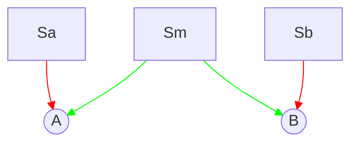
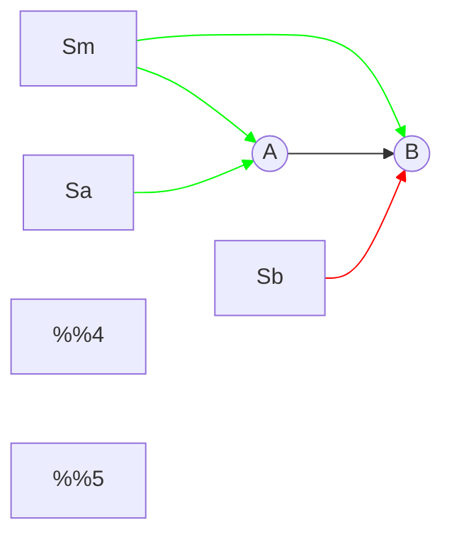
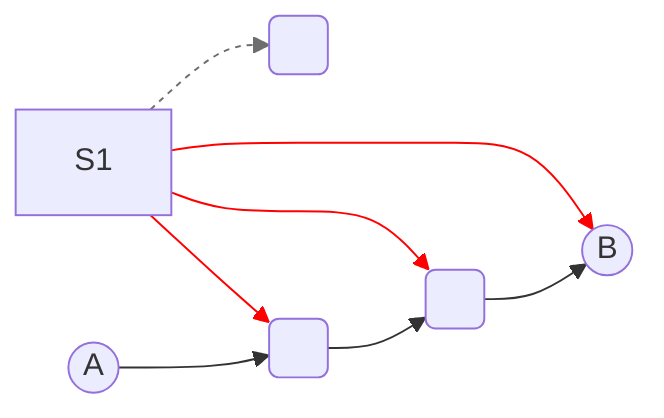
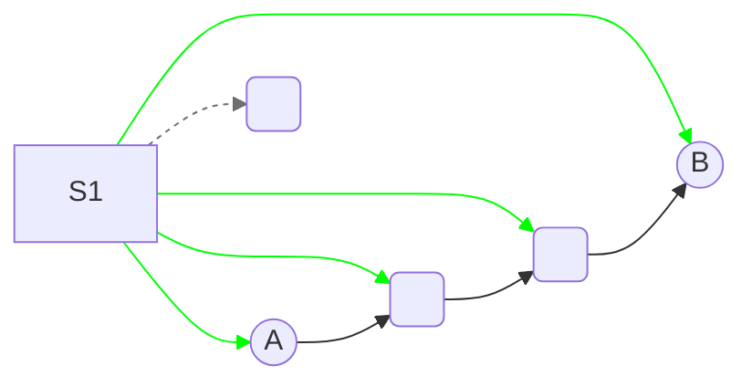
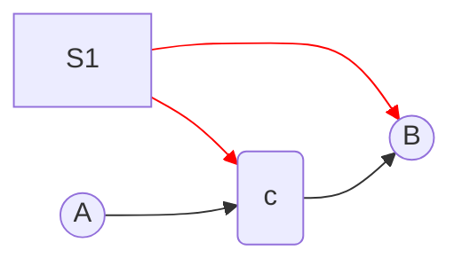
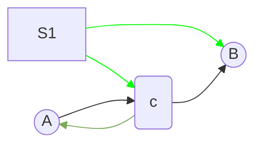
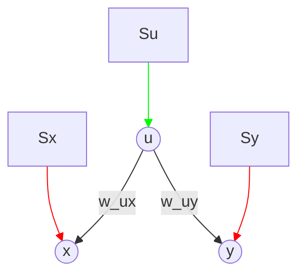

# High-level concept
We want to know how inputs delivered a certain location (S) in a network impact the observed connection strength (A→B).
This is useful to us because it helps us predict the impact of noise levels (input variance) on the strength of observed correlations - which leads to higher likelihood of inferring a connection.
This quantity, which we're calling ID-SNR is something we hope to maximize for true direct causal links, and minimize for indirect & confounded links.

Knowing the relationship between exogenous noise and correlation should allow us to design a profile of open-loop stimulation with tuned noise properties to optimize ID-SNR across the network

## Basic implementation
<!-- look into PlantUML for more advanced syntax / layout for graphs -->
<!-- below is example of custom theming for mermaid 
[more docs](https://github.com/mermaid-js/mermaid/blob/develop/docs/theming.md) -->
<!-- ```javascript
%%{init: 
  {'theme': 'base', 
  'themeVariables': { 'primaryColor': '#fff','primaryBorderColor':'#000'}
  }
}%%
``` -->


looking at the connection A→→B, signals shared in common between A and B will increases the strength of the observed correlation.
- In the case where A drives B, directly or indirectly (A→→B), inputs which drive B, but *not* A (such as S2 above) will introduce an independent noise source which will **decrease** the observed correlation between A,B.
- In this same case A→→B, any inputs which increase variance of A will lead to a stronger common single between A,B since this shared single "flow downstream" to B. In the circuit above, this means increasing the variances of S1 will increase the observed correlation between A,B.

Summarizing this:
\[
\mathrm{IDSNR}(A,B | S) \propto \frac{\color{green}\text{signal strength shared by A,B}}{\color{red}\text{independent signal strength in A or B}}
\]

In order to compute these, we need to understand whether the output of sources $S_i$ impacts either A or B. If so, we need to categorize its influence as $\text{\color{green}shared}$ or $\text{\color{red}independent}$ by tracing its downstream effects. 
**NOTE:** for now, we'll consider all edges to be "excitatory" meaning they have positive-valued edge-weights, although these ideas should generalize when we include accounting for the values of the weights.

**common input, no causal links (A B)**

**common input, A→B**

Note, how with A→B, Sa now contributes to *shared* signal strength, despite being a source of *independent* signal strength in the previous circuit.

For sources($S_i$) with a single downstream path, one way to classify whether these sources will to increase or decrease $\mathrm{IDSNR}(A,B|S_i)$ is:
- visually trace whether this path can reach either A or B. 
  - If not, that source doesn't affect IDSNR(A,B)
  - If it does, check whether it can reach both A and B 
    - if so, it contributes to $\text{\color{green}shared signal strength}$
    - if not, it contributes to $\text{\color{red}independent signal strength}$

Later we'll translate this sequence of steps into operations on reachability matrices.

## sources with multiple paths
**A→→B, S1 has multiple paths independent of A**

all paths resulting from S1 add signal to B which is independent of A, reducing IDSNR(A,B)

**A→→B, S1 has multiple paths - one path passing through A→→B turns other paths green**

adding S1→A means all connections flowing from S1 (which reach B) now contributed to the shared signal strength between A,B

**another example**



the link c→A opens the path S1→c→A 
resulting in S1 having a shared contribution to A & B

<details><summary>some incidental postulates</summary>

**Postulate:** a given source ($S_i$) cannot contribute to both $\text{\color{green}shared}$ and $\text{\color{red}independent}$ signal strength for a pair of nodes $(A,B)$.
  - i.e. $S_i$ either results in:
    - {shared (*& optionally,* unrelated)} paths OR 
    - {independent (*& optionally,* unrelated)} paths 
  - but never {shared and independent} paths.
  - this would lead to a nice partitioning of candidate locations ($S_i^+$) to increase variance in order to increase IDSNR for a pair of nodes $\textrm{IDSNR}(A,B | S_i)$ and a distinct set of locations ($S_j^-$) 
  
**Postulate:** sources (A) of true (in)direct links (A→→B) are sufficient to increase IDSNR(A,B)
  - if A→→B, then A ∈ $S^{+AB}$
  - moreover $S_i→→A$ is sufficient to conclude $S_i \in S^{+AB}$
    - since $S_i→→A$ and $A→→B$ 
      - therefore $S_i→→B$, $S_i \in S^{+AB}$
      
</details>

----
# Formalizing deciding membership in $S^+, S^-, S^\empty$
|            | $S_i→→A$     | $S_i ❌→A$ |
| ---------- | ------------ | ---------- |
| $S_i→→ B$  | $S^+$[^pnab] | $S^-$      |
| $S_i ❌→B$ | $S^-$        | $S^\empty$ |

where $S_i →→ N_j$ is a boolean reporting whether the reachability matrix $\mathcal{R}_{ij} \neq 0$.[^binarycomp]

[^binarycomp]: this can be solved through boolean operations on $R$

[^pnab]: for fully explicit notation $S^+$ is always referenced to a queried pair of nodes (A,B) i.e. $S^{+AB}$. The same node $S_i$ maybe $\in S^{+AB}$ but $\in S^{-CD}$ for instance
<!-- $$
S^?(S_i, A,B) = \left\{\begin{array}{lr}
    S^{+AB}, & R(S,A)\&R(S,B)\\
    S^{-AB}, & i>\\
    S^{\empty AB}, & \text{for } 0\leq n\leq 1
    \end{array}\right\}
$$ -->
----
# Quantifying impact
Revisiting our previous statement, now focusing on a single source $S_i$
\[
\mathrm{IDSNR}(A,B | S_i) \propto 
\frac
{\color{green}|S_i→A\&B|}
{\color{red}? + \sigma_A\sigma_B}
OR
\frac
{\color{green}\text{?}}
{\color{red} |S_i→A| + |S_i→B|}
\]
[^norm]
[^norm]: double check whether we intend positive and negative weights to partially cancel

# Combining sources
<!-- S_i→A + S_i→B -->
how to combine component-wise SNR?[^sum_SNR]
\[
\mathrm{IDSNR}(A,B | S) \propto 
\frac
{\color{green} \prod_{i\in S^+}{ ||S_i→A|| + ||S_i→B|| }}
{\color{red}\prod_{i\in S^-}{ ||S_i→A|| + ||S_i→B|| }}
\]

[^sum_SNR]: no idea whether this is the right way to "sum" contributions yet. We do know signals from sources are independent of each other, by definition, which should help


**common input, no causal links (A B)**

\[
\\
\mathrm{IDSNR}(A,B | S) \propto 
\frac
{\color{green}w_{cA}Sc + w_{cB}Sc}
{\color{red}w_{aA}Sa + w_{bB}Sb}
\]

stacking the variance this can be expressed as a ratio of vector products
\[
S = \begin{bmatrix}
        S_{a} \\
        S_{b} \\
        \vdots \\
        S_{z}
      \end{bmatrix}
\]
in the simple case with no multi-step links:
\[
w^{+AB} = \mathrm{Diag(I^+)}\begin{bmatrix}
        w_{aA} + w_{aB} \\
        w_{bA} + w_{bB}  \\
        \vdots \\
        w_{zA} + w_{zB} 
      \end{bmatrix}
\]
where elements of $I_i^+$ are indicators: $1$ if $S_i \in S^+$ else $0$, and $\mathrm{Diag()}$ is an operation exapanding a column vector to the diagonal entries of a square matrix, with off-diagonal elements set to $0$.

in the more general case we use the net, weighted reachability $R^w$
\[
w^{+AB} = \mathrm{Diag(I^+)}\left(R^w(:,A) + R^w(:,B)\right)
\]
\[
\\
\mathrm{IDSNR}(A,B | S) \propto 
\frac
{\color{green}w_{cA}Sc + w_{cB}Sc}
{\color{red}w_{aA}Sa + w_{bB}Sb}
=\frac{w^{+AB}S}{w^{-AB}S}
\]
[^dub][^sqr]
[^dub]: does this lead to double counting?
[^sqr]: verify convention with whether $S_i$ represents the output variance versus standard deviation, and whether therefore we need to square any of these terms


---
