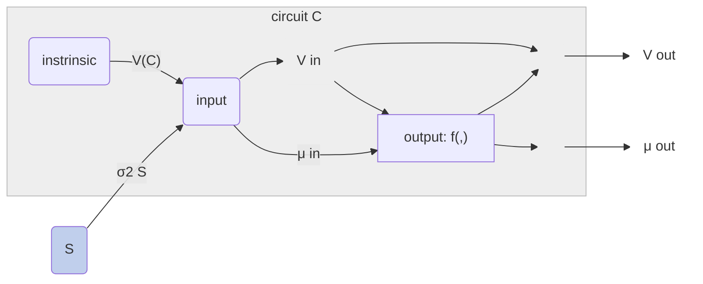

While a primary advantage of closed-loop interventions for circuit inference is its ability to functionally lesion indirect connections, another, more nuanced `(quantitative)` advantage of closed-loop control lies in its capacity to bidirectionally control output variance. While the variance of an open-loop stimulus can be titrated to adjust the output variance at a node, in general, an open-loop stimulus cannot reduce this variance below its instrinsic[^intrinsic_var] variability. That is, if the system is linear with Gaussian noise,
$$\mathbb{V}_{i}(C|S=\text{open},\sigma^2_S) \geq \mathbb{V}_{i}(C)$$
More specifically, if the open-loop stimulus is statistically independent from the intrinsic variability[^open_loop_independent]
$$\mathbb{V}_{i}(C|S=\text{open},\sigma^2_S) = \mathbb{V}_{i}(C) + \sigma^2_S$$
Applying closed-loop to a linear Gaussian circuit:

\[
\begin{align}
\mathbb{V}_{i}(C|S=\text{closed},\sigma^2_S) &= \sigma^2_S \\
\mathbb{V}_{i}(C|S=\text{closed},\sigma^2_S) &\perp \mathbb{V}_{i}(C)
\end{align}
\]

## Firing rates (non-negativity)
In neural circuits, we're often interested in firing rates, which are non-negative. This particular output nonlinearity means that the linear Gaussian assumptions do not hold, especially in the presence of strong inhibitory inputs. In this setting, firing rate variability is coupled to its mean rate; Under a homoeneous-rate Poisson assumption, mean firing rate and firing rate variability would be proportional. With inhibitory inputs, open-loop stimulus can drive firing rates low enough to reduce their variability. Here, feedback control still provides an advantage in being able to control the mean and variance of firing rates independently[^cl_indp_practical]

(work in progress)

\[
\begin{align}
\mu^{out}_i &= f(\mu^{in}_i, \mathbb{V}^{in}_i)\\
\mathbb{V}^{out}_{i}(C) &= f(\mu^{out}_i, \mathbb{V}^{in}_i)
\end{align}
\]

## Notes on imperfect control 

`Ideal control`
\[
\mathbb{V}_{i}(C|S=\text{closed},\sigma^2_S) = \sigma^2_S 
\]
`Imperfect control` - intuitively feedback control is counteracting / subtracting disturbance due to unobserved sources, including intrinsic variability. We could summarize the effectiveness of closed-loop disturbance rejection with a scalar $0\leq\gamma\leq1$
\[
\mathbb{V}_{i}(C|S=\text{closed},\sigma^2_S) = \mathbb{V}_{i}(C) - \gamma\mathbb{V}_{i}(C) + \sigma^2_S \\
\mathbb{V}_{i}(C|S=\text{closed},\sigma^2_S) = (1-\gamma) \mathbb{V}_{i}(C) + \sigma^2_S
\]

[^open_loop_independent]: notably, this is part of the definition of open-loop intervention
[^cl_indp_practical]: practically, this requires very fast feedback to achieve fully independent control over mean and variance. In the case of firing rates, I suspect $\mu \leq \alpha\mathbb{V}$, so variances can be reduced, but for very low firing rates, there's still an upper limit on what the variance can be.
